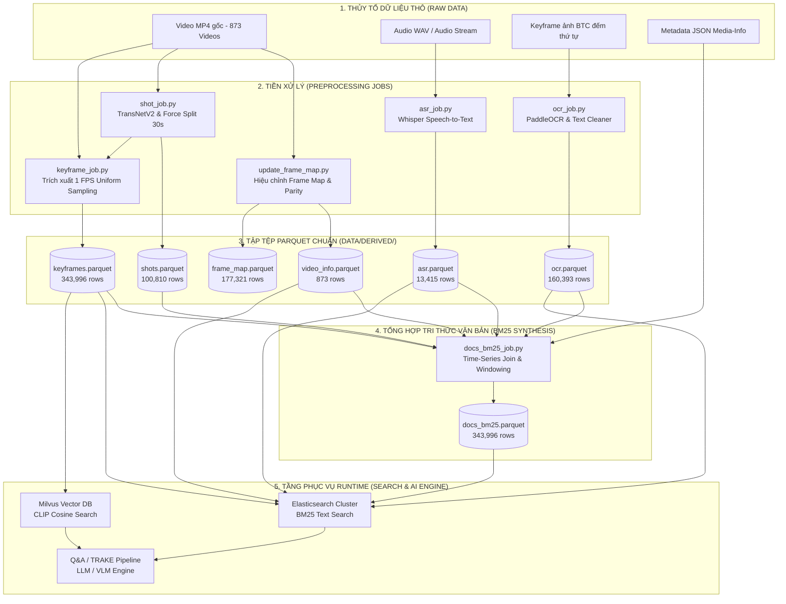

# ĐẶC TẢ KỸ THUẬT VÀ TOÀN THƯ KIẾN TRÚC DỮ LIỆU PHASE B (DATA PIPELINE SPECIFICATION)

> **Tài liệu Bàn giao Kỹ thuật Cấp độ Hệ thống (System-Level Handoff Specification)**  
> **Tác giả:** Kỹ sư Dữ liệu (Công Lý - Data Engineer)  
> **Dự án:** Hệ thống Truy xuất Khoảnh khắc Video AI Challenge HCMC 2026  
> **Đối tượng đọc:** Tất cả AI Agents, Kỹ sư Backend, Kỹ sư AI Retrieval, Kỹ sư UI, và Ban Giám Khảo/Reviewer.  
> **Mục tiêu:** Cung cấp bức tranh toàn cảnh 100% chuẩn xác theo mã nguồn thực tế, đặc tả chi tiết từng bit dữ liệu, cấu trúc 7 file Parquet, các thuật toán xử lý Time-Series Join, bất biến hệ thống (Invariants), và hướng dẫn nạp dữ liệu vào Database.

---

## MỤC LỤC

1. [BỐI CẢNH DỰ ÁN & THỂ THỨC THI (CONTEST CONTEXT)](#1-bối-cảnh-dự-án--thể-thức-thi-contest-context)
2. [SƠ ĐỒ KIẾN TRÚC & LUỒNG XỬ LÝ DỮ LIỆU (DATA ARCHITECTURE)](#2-sơ-đồ-kiến-trúc--luồng-xử-lý-dữ-liệu-data-architecture)
3. [ĐẶC TẢ CHI TIẾT LƯỢC ĐỒ 7 FILE PARQUET (`data/derived/`)](#3-đặc-tả-chi-tiết-lược-đồ-7-file-parquet-dataderived)
   - [3.1 `video_info.parquet` (873 dòng)](#31-video_infoparquet-873-dòng)
   - [3.2 `frame_map.parquet` (177,321 dòng)](#32-frame_mapparquet-177321-dòng)
   - [3.3 `shots.parquet` (100,810 dòng)](#33-shotsparquet-100810-dòng)
   - [3.4 `keyframes.parquet` (371,633 dòng)](#34-keyframesparquet-371633-dòng)
   - [3.5 `asr.parquet` (13,415 dòng)](#35-asrparquet-13415-dòng)
   - [3.6 `ocr.parquet` (160,393 dòng)](#36-ocrparquet-160393-dòng)
   - [3.7 `docs_bm25.parquet` (343,996 dòng)](#37-docs_bm25parquet-343996-dòng)
4. [ĐẶC TẢ THUẬT TOÁN & LOGIC CODE THỰC THI CHÍNH](#4-đặc-tả-thuật-toán--logic-code-thực-thi-chính)
   - [4.1 Task B0.1: Video Metadata & Frame Map Monotonic Alignment](#41-task-b01-video-metadata--frame-map-monotonic-alignment)
   - [4.2 Task B1.1: Shot Segmentation & Force-Split Strategy](#42-task-b11-shot-segmentation--force-split-strategy)
   - [4.3 Task B1.2: Keyframe Extraction (1 FPS Sampling Strategy)](#43-task-b12-keyframe-extraction-1-fps-sampling-strategy)
   - [4.4 Task B1.3: Audio Speech Recognition (ASR Whisper Pipeline)](#44-task-b13-audio-speech-recognition-asr-whisper-pipeline)
   - [4.5 Task B1.4: Optical Character Recognition (PaddleOCR / Vision Pipeline)](#45-task-b14-optical-character-recognition-paddleocr--vision-pipeline)
   - [4.6 Task B1.7: BM25 Time-Series Document Synthesis (`docs_bm25_job.py`)](#46-task-b17-bm25-time-series-document-synthesis-docs_bm25_jobpy)
5. [QUY TẮC BẤT BIẾN HỆ THỐNG (SYSTEM INVARIANTS)](#5-quy-tắc-bất-biến-hệ-thống-system-invariants)
6. [QUY TRÌNH AUDIT & NGHIỆM THU DỮ LIỆU (AUDIT SUITE)](#6-quy-trình-audit--nghiệm-thu-dữ-liệu-audit-suite)
7. [HƯỚNG DẪN TÍCH HỢP CHO BACKEND & AI MODULES](#7-hướng-dẫn-tích-hợp-cho-backend--ai-modules)
8. [BẢNG TRA CỨU SỰ CỐ & CÁCH KHẮC PHỤC (TROUBLESHOOTING)](#8-bảng-tra-cứu-sự-cố--cách-khắc-phục-troubleshooting)

---

## 1. BỐI CẢNH DỰ ÁN & THỂ THỨC THI (CONTEST CONTEXT)

Hệ thống được thiết kế phục vụ cuộc thi **AI Challenge HCMC 2026** theo thể thức VBS / LSC. Dự án tập trung giải quyết 3 dạng bài truy xuất video khắt khe:

1. **Textual KIS (Known-Item Search)**: Tìm một khoảnh khắc duy nhất trong video dựa trên mô tả văn bản.
2. **Q&A (Question Answering)**: Trả lời câu hỏi ngắn dựa trên bằng chứng thị giác, âm thanh hoặc chữ xuất hiện trong video.
3. **TRAKE (Temporal Action and Keyframe Extraction)**: Tìm chuỗi sự kiện diễn ra theo đúng thứ tự thời gian trong cùng một video.

### Yêu cầu Nộp bài (Submission Hard Constraints)
- Mọi kết quả tìm kiếm được xuất ra file CSV / JSON để nộp cho BTC.
- Mọi kết quả nộp bài bắt buộc phải gồm: `video_id` và `frame_id`.
- **ĐẶC BIỆT LƯU Ý**: `frame_id` nộp bài phải là **chỉ số frame tuyệt đối (Absolute Frame Index)** trong chuỗi video gốc (tính từ 0). 
- **CẢNH BÁO TỬ HUYỆT**: Số thứ tự file ảnh do BTC cung cấp (ví dụ `0000.jpg`, `0001.jpg` trong thư mục keyframe) là chỉ số đếm cục bộ trong thư mục đó, **KHÔNG PHẢI** chỉ số frame tuyệt đối trong video. Nhầm lẫn giữa 2 chỉ số này sẽ dẫn đến việc hệ thống chấm điểm tự động của BTC trả về kết quả **0 ĐIỂM TUYỆT ĐỐI** mặc dù tìm đúng video.

---

## 2. SƠ ĐỒ KIẾN TRÚC & LUỒNG XỬ LÝ DỮ LIỆU (DATA ARCHITECTURE)

Dữ liệu được xử lý qua pipeline đa tầng khép kín từ dữ liệu thô (Raw) đến các bảng Parquet tiêu chuẩn hóa (Derived Data), chuẩn bị sẵn sàng cho tầng lưu trữ Indexing (Elasticsearch + Milvus Vector Database).



---

## 3. ĐẶC TẢ CHI TIẾT LƯỢC ĐỒ 7 FILE PARQUET (`data/derived/`)

Tất cả các file đều tuân thủ định dạng Apache Parquet, lưu giữ kiểu dữ liệu tĩnh (Strongly Typed). Dưới đây là đặc tả 100% chính xác từng cột, kiểu dữ liệu, nghĩa nghiệp vụ và mẫu dữ liệu thực tế trích từ hệ thống.

### 3.1 `video_info.parquet` (873 dòng)
Lưu trữ thông số kỹ thuật vĩ mô của 873 video trong tập dữ liệu.

- **Đường dẫn**: `data/derived/video_info.parquet`
- **Số dòng**: 873
- **Bảng tả chi tiết từng trường**:

| Tên Cột | Kiểu Dữ Liệu (Dtype) | Mô Tả Nghiệp Vụ & Giới Hạn | Mẫu Dữ Liệu Thực Tế |
|---|---|---|---|
| `video_id` | `object` / `string` | **Primary Key**. Mã định danh duy nhất của video (dạng `L{N}_V{M}`). | `"L22_V010"` |
| `fps_num` | `int64` | Tử số của Tốc độ khung hình (Frame Rate Numerator). | `25` |
| `fps_den` | `int64` | Mẫu số của Tốc độ khung hình (Frame Rate Denominator). FPS = `fps_num / fps_den`. | `1` |
| `nb_frames_decoded` | `int64` | Tổng số lượng frame vật lý giải mã được từ luồng video MP4. | `27276` |
| `path` | `object` / `string` | Đường dẫn tương đối đến file MP4 nguồn trên đĩa cứng. | `"data/raw/videos/videos_L22_a/L22_V010.mp4"` |
| `duration_sec` | `float64` | Thời lượng thực tế của video tính bằng giây. | `1091.105669` |
| `has_audio` | `bool` | Cờ báo video có chứa luồng âm thanh hay không. | `True` |
| `is_vfr` | `bool` | Cờ báo video thuộc dạng Variable Frame Rate (Tần số khung hình biến thiên). | `False` |

---

### 3.2 `frame_map.parquet` (177,321 dòng)
Bản đồ tra cứu từ điển thời gian thực cho các keyframe từ tập ảnh do BTC phát hành. Giải quyết bài toán trượt thời gian (Frame Drift).

- **Đường dẫn**: `data/derived/frame_map.parquet`
- **Số dòng**: 177,321
- **Bảng tả chi tiết từng trường**:

| Tên Cột | Kiểu Dữ Liệu (Dtype) | Mô Tả Nghiệp Vụ & Giới Hạn | Mẫu Dữ Liệu Thực Tế |
|---|---|---|---|
| `video_id` | `object` / `string` | Khóa ngoại trỏ về `video_info.parquet`. | `"L21_V001"` |
| `btc_ordinal` | `int64` | Số thứ tự file keyframe đếm trong folder của BTC (chỉ số 1-indexed). | `1` |
| `frame_idx` | `int64` | **Chỉ số Frame tuyệt đối** thực tế trong video (0-indexed). | `0` |
| `pts_time` | `float64` | Thời gian hiển thị Presentation Time Stamp (tính bằng giây). | `0.0` |
| `fps` | `float64` | Tốc độ khung hình quy đổi cho video tại mốc này. | `30.0` |
| `kf_id` | `object` / `string` | Mã Keyframe theo định dạng cũ của BTC (dạng `{video_id}#k{ordinal:04d}`). | `"L21_V001#k0001"` |

---

### 3.3 `shots.parquet` (100,810 dòng)
Kết quả phân đoạn video thành các phân cảnh (Shot) bằng AI TransNetV2 kết hợp PySceneDetect.

- **Đường dẫn**: `data/derived/shots.parquet`
- **Số dòng**: 100,810
- **Bảng tả chi tiết từng trường**:

| Tên Cột | Kiểu Dữ Liệu (Dtype) | Mô Tả Nghiệp Vụ & Giới Hạn | Mẫu Dữ Liệu Thực Tế |
|---|---|---|---|
| `shot_id` | `object` / `string` | **Primary Key**. Định dạng `{video_id}#s{shot_seq:04d}`. | `"L21_V001#s0000"` |
| `video_id` | `object` / `string` | Khóa ngoại trỏ về `video_info.parquet`. | `"L21_V001"` |
| `shot_seq` | `int32` | Số thứ tự shot trong video (tính từ 0). | `0` |
| `start_frame` | `int64` | Frame tuyệt đối bắt đầu của Shot. | `0` |
| `end_frame` | `int64` | Frame tuyệt đối kết thúc của Shot. | `346` |
| `n_frames` | `int32` | Tổng số frame trong Shot (`end_frame - start_frame + 1`). | `347` |
| `duration_s` | `float64` | Thời lượng của Shot tính theo giây. | `11.5667` |
| `is_force_split` | `bool` | Cờ báo Shot gốc > 60s bị hệ thống ép cắt nhỏ thành các đoạn 30s. | `False` |
| `n_raw_shots_merged` | `int32` | Số lượng raw shot quá ngắn được gom lại. | `2` |
| `detector_confidence`| `float32` | Độ tin cậy của thuật toán phát hiện biên giới Shot. | `39.44855` |
| `detector` | `object` / `string` | Tên mô hình AI cắt Shot (`pyscenedetect` hoặc `transnetv2`). | `"pyscenedetect"` |
| `config_hash` | `object` / `string` | Mã hash chữ ký của cấu hình thuật toán cắt. | `"fc5908cf2177"` |
| `split_reason` | `object` / `string` | Lý do phân chia cảnh (`detector` hoặc `force_split`). | `"detector"` |
| `rep_kf_id` | `object` / `string` | Khóa trỏ về Keyframe đại diện của Shot (`rep_kf`). | `"L21_V001#k0002"` |
| `rep_source` | `object` / `string` | Nguồn gốc lấy rep_kf (`btc` hoặc `center_frame`). | `"btc"` |
| `rep_offset` | `float64` | Khoảng lệch thời gian (giây) của rep_kf so với tâm Shot. | `-83.0` |
| `keyframes_config_hash`| `object` / `string`| Hash cấu hình trích xuất Keyframe. | `"fc5908cf2177"` |

---

### 3.4 `keyframes.parquet` (343,996 dòng)
Tập hợp toàn bộ các khung hình chốt được trích xuất đều đặn với mật độ **1 FPS** (1 khung hình mỗi giây). Đây là tập xương sống để trích xuất Feature CLIP Vector và hiển thị UI Debug.

- **Đường dẫn**: `data/derived/keyframes.parquet`
- **Số dòng**: 343,996
- **Bảng tả chi tiết từng trường**:

| Tên Cột | Kiểu Dữ Liệu (Dtype) | Mô Tả Nghiệp Vụ & Giới Hạn | Mẫu Dữ Liệu Thực Tế |
|---|---|---|---|
| `kf_id` | `string` | **Primary Key chuẩn hóa**. Định dạng `{video_id}_{frame_idx:07d}`. | `"L22_V004_0000009"` |
| `video_id` | `string` | Khóa ngoại trỏ về `video_info.parquet`. | `"L22_V004"` |
| `shot_id` | `string` | Khóa ngoại trỏ về `shots.parquet`. | `"L22_V004#s0000"` |
| `frame_idx` | `int64` | **Chỉ số Frame tuyệt đối** của Keyframe trong video gốc. | `9` |
| `path` | `string` | Đường dẫn tương đối lưu file ảnh JPEG trên đĩa. | `"keyframes/L22_V004/f0000009.jpg"` |
| `row_id` | `int64` | Chỉ số hàng toàn cục (Global Row Index, trỏ thẳng vào ma trận CLIP vector). | `0` |

---

### 3.5 `asr.parquet` (13,415 dòng)
Dữ liệu bóc băng lời nói thành văn bản (Speech-to-Text) chạy bằng mô hình **Whisper Large v3 Turbo**.

- **Đường dẫn**: `data/derived/asr.parquet`
- **Số dòng**: 13,415
- **Bảng tả chi tiết từng trường**:

| Tên Cột | Kiểu Dữ Liệu (Dtype) | Mô Tả Nghiệp Vụ & Giới Hạn | Mẫu Dữ Liệu Thực Tế |
|---|---|---|---|
| `video_id` | `string` | Khóa ngoại trỏ về `video_info.parquet`. | `"L21_V001"` |
| `seg_id` | `int32` | Số thứ tự phân đoạn hội thoại trong video (tính từ 0). | `0` |
| `start_s` | `float32` | Thời điểm bắt đầu câu thoại (tính theo giây). | `125.98` |
| `end_s` | `float32` | Thời điểm kết thúc câu thoại (tính theo giây). | `146.88` |
| `start_frame` | `int64` | Frame tuyệt đối bắt đầu thoại (`int(start_s * fps)`). | `3779` |
| `end_frame` | `int64` | Frame tuyệt đối kết thúc thoại (`int(end_s * fps)`). | `4406` |
| `text_vi` | `string` | Nội dung văn bản lời nói tiếng Việt gỡ băng được. | `"Tại thành phố Cần Thơ 7 tháng đầu năm 2024..."` |
| `avg_logprob` | `float32` | Xác suất log trung bình của câu thoại (càng gần 0 càng chính xác). | `-0.2415` |
| `no_speech_prob` | `float32` | Xác suất đoạn audio không có tiếng người nói. | `0.0124` |

---

### 3.6 `ocr.parquet` (160,393 dòng)
Dữ liệu nhận diện chữ xuất hiện trên màn hình video (Optical Character Recognition) bằng mô hình **PaddleOCR** / **Apple Vision Framework**.

- **Đường dẫn**: `data/derived/ocr.parquet`
- **Số dòng**: 160,393
- **Bảng tả chi tiết từng trường**:

| Tên Cột | Kiểu Dữ Liệu (Dtype) | Mô Tả Nghiệp Vụ & Giới Hạn | Mẫu Dữ Liệu Thực Tế |
|---|---|---|---|
| `video_id` | `string` | Khóa ngoại trỏ về `video_info.parquet`. | `"L21_V001"` |
| `kf_id` | `string` | Khóa Keyframe theo chuẩn BTC (`{video_id}#k{ordinal:04d}`). | `"L21_V001#k0001"` |
| `frame_idx` | `int64` | Frame tuyệt đối tương ứng với bức ảnh được quét OCR. | `0` |
| `text_raw` | `string` | Văn bản OCR thô giữ nguyên hoa/thường và dấu tiếng Việt. | `"06:30:11 giây)"` |
| `text_clean` | `string` | Văn bản OCR đã dọn sạch dấu tiếng Việt và ép về chữ thường. | `"06:30:11 giay)"` |
| `n_boxes` | `int32` | Số lượng Bounding Box chứa chữ phát hiện được trên ảnh. | `2` |
| `avg_conf` | `float32` | Độ tin cậy trung bình của các Bounding Box (0.0 -> 1.0). | `1.0` |
| `boxes` | `string` | Chuỗi JSON chứa mảng các tọa độ Bounding Box `[x, y, w, h]`. | `"[[0.817, 0.838, 0.065, 0.029], ...]"` |

---

### 3.7 `docs_bm25.parquet` (343,996 dòng)
**CƠ SỞ DỮ LIỆU TÌM KIẾM TRUNG TÂM (CORE BM25 TEXTUAL CORPUS)**. Mỗi hàng đại diện cho đúng 1 Keyframe (khớp 1-1 với `keyframes.parquet`), tổng hợp toàn bộ ngữ cảnh Textual xung quanh khung hình đó.

- **Đường dẫn**: `data/derived/docs_bm25.parquet`
- **Số dòng**: 343,996
- **Bảng tả chi tiết từng trường**:

| Tên Cột | Kiểu Dữ Liệu (Dtype) | Mô Tả Nghiệp Vụ & Giới Hạn | Mẫu Dữ Liệu Thực Tế |
|---|---|---|---|
| `kf_id` | `string` | **Primary Key chuẩn hóa**, khớp 1-1 với `keyframes.parquet`. | `"L22_V004_0000009"` |
| `video_id` | `object` / `string` | Mã định danh video. | `"L22_V004"` |
| `shot_id` | `object` / `string` | Mã phân cảnh Shot chứa Keyframe này. | `"L22_V004#s0000"` |
| `frame_idx` | `int64` | Chỉ số Frame tuyệt đối trong video gốc. | `9` |
| `doc_text` | `object` / `string` | **VĂN BẢN HỢP NHẤT TOÀN DIỆN**. Hạ về chữ thường (`.lower()`), chứa 4 khối thông tin: Title, Description, ASR (±3s), và OCR (Shot Level). | `"[title] 60 giây chiều...\n[desc] 60 giây chiều...\n[asr] cảm ơn các bạn...\n[ocr] 18:29:58 hd giay"` |

---

## 4. ĐẶC TẢ THUẬT TOÁN & LOGIC CODE THỰC THI CHÍNH

### 4.1 Task B0.1: Video Metadata & Frame Map Monotonic Alignment
- **Vấn đề Kỹ thuật**: Các video MP4 thu từ nhiều nguồn truyền hình khác nhau có hiện tượng Variable Frame Rate (VFR) hoặc bị mất frame header. Công thức tính frame ngây thơ `frame_idx = time * fps` sẽ làm lệch frame từ vài giây đến hàng chục giây khi video dài.
- **Giải pháp Thuật toán**:
  1. Sử dụng OpenCV / FFmpeg giải mã trực tiếp toàn bộ luồng video stream để ghi nhận chỉ số `frame_idx` thực tế và timestamp `pts_time` tương ứng.
  2. Xây dựng bảng tra cứu `frame_map.parquet`.
  3. Áp dụng thuật toán kiểm tra tính đơn điệu tăng (Strictly Monotonic Check):
     ```text
     frame_idx_corrected[i] = frame_idx_raw[i] + kf_offset[i]
     ```
     Bắt buộc thỏa mãn: `frame_idx_corrected[i] > frame_idx_corrected[i-1]` trên toàn bộ 873 video.
  4. Chạy script nghiệm thu `preprocessing/test_opencv_parity.py` kiểm tra Parity 20 mẫu ngẫu nhiên để khẳng định sai số frame bằng 0.

### 4.2 Task B1.1: Shot Segmentation & Force-Split Strategy
- **Thuật toán Phân cảnh**: Sử dụng mạng nơ-ron TransNetV2 (hoặc PySceneDetect với ngưỡng `threshold = 27.0`) quét qua sự thay đổi màu sắc và tần số không gian giữa các frame liên tiếp để xác định biên giới chuyển cảnh.
- **Chiến lược Ép Cắt (Force-Split Strategy)**:
  - Nếu một Shot dài quá 60 giây (`> 60 * fps` frames), thuật toán tự động chia nhỏ cưỡng bức thành các sub-shot dài tối đa 30 giây.
  - Lý do: Một Shot quá dài sẽ làm loãng thông tin đại diện (`rep_kf`), làm giảm độ chính xác khi vector hóa hoặc làm sai lệch cửa sổ ASR.
  - Các sub-shot bị cắt cưỡng bức sẽ được đánh dấu cờ `is_force_split = True` và ghi rõ `split_reason = "force_split"`.

### 4.3 Task B1.2: Keyframe Extraction (1 FPS Sampling Strategy)
- **Tần suất Lấy mẫu**: 1 FPS (Đúng 1 giây lấy 1 khung hình).
- **Thuật toán Bằng chứng Boundary**:
  - Đối với mỗi Shot trong `shots.parquet`, tính số lượng keyframe lý thuyết: `N = round(duration_s)`.
  - Áp dụng giới hạn biên (Bounding Constraints): `min(N) = 2`, `max(N) = 20`.
  - Mọi khung hình chốt được đặt tên `kf_id` chuẩn hóa dưới dạng string zero-padded 7 chữ số: `{video_id}_{frame_idx:07d}`.
- **Thông số Kỹ thuật Ảnh**:
  - Định dạng: JPEG Quality 90 (`q90`).
  - Kích thước: Cạnh dài nhất (Max Dimension) resample về đúng `448px`, giữ nguyên tỷ lệ khung hình (Aspect Ratio).
  - Không gian màu: RGB 3-channel.

### 4.4 Task B1.3: Audio Speech Recognition (ASR Whisper Pipeline)
- **Tiền xử lý Audio**: Tách riêng luồng âm thanh khỏi file video MP4 sang định dạng WAV 16kHz Mono bằng `ffmpeg`:
  `ffmpeg -i input.mp4 -vn -acodec pcm_s16le -ar 16000 -ac 1 audio.wav`
- **Mô hình AI Bóc băng**:
  - Trục Apple Silicon M5: Chạy thư viện `mlx_whisper` tối ưu hóa trên Neural Engine với mô hình `mlx-community/whisper-large-v3-turbo`.
  - Trục Kaggle / GPU: Chạy `faster-whisper` hoặc PhoWhisper.
- **Công thức Quy đổi Thời gian -> Frame Index**:
  ```python
  start_frame = int(start_s * (fps_num / fps_den))
  end_frame = int(end_s * (fps_num / fps_den))
  ```

### 4.5 Task B1.4: Optical Character Recognition (PaddleOCR / Vision Pipeline)
- **Động cơ OCR**:
  - macOS: Sử dụng Apple Vision Framework (`VNRecognizeTextRequest` cấp độ `VNRequestTextRecognitionLevelAccurate`) chạy trực tiếp trên Apple Neural Engine.
  - Windows / Kaggle: Sử dụng `PaddleOCR(use_angle_cls=True, lang="vi")`.
- **Thuật toán Làm sạch Văn bản (`text_clean`)**:
  Để phục vụ tìm kiếm BM25 không phân biệt dấu tiếng Việt, chuỗi thô `text_raw` được đưa qua thuật toán chuẩn hóa Unicode NFD:
  ```python
  import unicodedata, re

  def remove_accents(input_str):
      if not isinstance(input_str, str): return ""
      s1 = unicodedata.normalize('NFD', input_str)
      s2 = re.sub(r'[\u0300-\u036f]', '', s1)
      s3 = s2.replace('đ', 'd').replace('Đ', 'D')
      return s3.lower().strip()
  ```

### 4.6 Task B1.7: BM25 Time-Series Document Synthesis (`docs_bm25_job.py`)
Job quan trọng nhất trong việc hợp nhất đa nguồn dữ liệu vào `docs_bm25.parquet`. Thực thi qua 5 bước nghiêm ngặt:

1. **Đọc Dữ liệu Khởi tạo**: Nạp `keyframes.parquet` (343,996 dòng) làm khung chuẩn.
2. **Gộp Metadata JSON**: Quét thư mục `data/raw/btc/metadata/media-info/*.json`. Đọc `title` và `description` gộp theo `video_id`.
3. **Gộp OCR qua Thuật toán Time-Series Join (`merge_asof`)**:
   - Do OCR chạy trên ảnh đại diện `rep_kf` có chỉ số `kf_id` theo format BTC (`L21_V001#k0001`), không thể join bằng chuỗi trực tiếp vào `kf_id` chuẩn hóa mới (`L22_V004_0000009`).
   - Giải pháp: Đưa cả `ocr.parquet` và `shots.parquet` về dạng sắp xếp theo `frame_idx` và `start_frame`.
   - Thực thi `pandas.merge_asof`:
     ```python
     df_ocr_mapped = pd.merge_asof(
         df_ocr.sort_values("frame_idx"), 
         df_shots[["video_id", "shot_id", "start_frame"]].sort_values("start_frame"), 
         left_on="frame_idx", 
         right_on="start_frame", 
         by="video_id", 
         direction="backward"
     )
     ```
   - Thuật toán tìm `shot_id` có `start_frame` nhỏ hơn hoặc bằng `ocr.frame_idx` gần nhất trong cùng `video_id`.
   - Gom toàn bộ `text_clean` của OCR theo `shot_id` vừa tìm được, sau đó join ngược vào `keyframes.parquet` theo `shot_id`. Kết quả: Toàn bộ keyframe con trong Shot đều thừa hưởng chữ OCR của Shot đó.
4. **Gộp ASR theo Cửa sổ Thời gian Động (Dynamic Time-Window ±3s)**:
   - Với mỗi Keyframe thứ `i` có chỉ số frame `kf_frame`, tính độ rộng cửa sổ thời gian 3 giây theo frame:
     `window = 3.0 * (fps_num / fps_den)`
   - Lọc tất cả các phân đoạn thoại ASR của video đó thỏa mãn điều kiện giao nhau (Overlap condition):
     `(start_frame_asr <= kf_frame + window) AND (end_frame_asr >= kf_frame - window)`
   - Nối toàn bộ văn bản `text_vi` của các phân đoạn ASR thỏa mãn thành một chuỗi duy nhất `asr_text`.
5. **Đóng gói Cấu trúc Document & Lowercase Normalization**:
   - Định dạng khối văn bản `doc_text` theo cú pháp chuẩn:
     ```text
     [TITLE] {meta_title}
     [DESC] {meta_desc}
     [ASR] {asr_text}
     [OCR] {ocr_text}
     ```
   - Toàn bộ chuỗi được gọi `.lower()` để đảm bảo tính đồng nhất khi đưa vào Elasticsearch Analyzer.

---

## 5. QUY TẮC BẤT BIẾN HỆ THỐNG (SYSTEM INVARIANTS)

> [!CAUTION]
> **NHỮNG NGUYÊN TẮC THÉP - VI PHẠM SẼ GÂY LỖI IM LẶNG HOẶC LÀM KẾT QUẢ NỘP BÀI BẰNG 0 ĐIỂM**

1. **DUY NHẤT MỘT CHUẨN KHOÁ JOIN**:
   - Tất cả các liên kết dữ liệu giữa Elasticsearch, Milvus Vector DB, và các file Parquet **CHỈ ĐƯỢC PHÉP** sử dụng `kf_id` chuẩn hóa (`L22_V004_0000009`) hoặc cặp định danh `(video_id, frame_idx)`.
   - **TUYỆT ĐỐI CẤM** dùng số đếm file `0000.jpg`, `0001.jpg` của BTC làm khóa chính hoặc lưu trữ trong CSDL.

2. **CHUẨN XUẤT FILE NỘP BÀI (SUBMISSION FORMAT)**:
   - Trường `frame_id` trong file nộp bài cho BTC (CSV/JSON) **BẮT BUỘC** phải lấy giá trị từ cột `frame_idx` (chỉ số frame tuyệt đối thực tế trong video gốc).
   - Nhầm lẫn `frame_id` nộp bài với số thứ tự ảnh BTC sẽ làm mất trắng 100% điểm số bài thi.

3. **CHUẨN VECTOR TRONG MILVUS (VECTOR NORMALIZATION)**:
   - Mọi feature vector (CLIP / OpenCLIP) bắt buộc phải được **L2-Normalize** trước khi đưa vào index Milvus và trước khi query.
   - Metric đo lường khoảng cách cấu hình trong Milvus **BẮT BUỘC** là `COSINE`.
   - Đảm bảo độ dài Vector norm: `||v||_2 ≈ 1.0`.

4. **ĐIỂM NẠP LLM DUY NHẤT (LLM ADAPTER ENFORCEMENT)**:
   - Mọi thao tác gọi LLM (OpenAI, Anthropic, Ollama local) trong toàn bộ mã nguồn hệ thống **BẮT BUỘC** phải thông qua hàm `llm()` tại file `backend/llm/adapter.py`.
   - **TUYỆT ĐỐI CẤM** import trực tiếp SDK `anthropic`, `openai`, `google.generativeai` ở bất kỳ file nào khác trong thư mục `backend/` hay `preprocessing/`.

---

## 6. QUY TRÌNH AUDIT & NGHIỆM THU DỮ LIỆU (AUDIT SUITE)

Để đảm bảo tính toàn vẹn dữ liệu trước khi nạp vào CSDL, hệ thống triển khai 3 cấp độ kiểm thử tự động (Audit Suite):

### Audit Level 1: Kiểm tra Số lượng & Số hàng Đã khớp (Parity Assertion)
Chạy script `scripts/audit/b17_docs_bm25.py`:
- Kịch bản: Khẳng định số lượng hàng trong `docs_bm25.parquet` phải bằng đúng số lượng hàng trong `keyframes.parquet`.
- Trạng thái nghiệm thu: **PASSED (343,996 / 343,996 rows)**.

### Audit Level 2: Kiểm tra Độc lập Giá trị Null & Khóa bị thiếu (Null & Key Assertion)
- Đảm bảo 100% các cột `kf_id`, `video_id`, `shot_id`, `frame_idx` không chứa bất kỳ giá trị `NaN` hay `Null` nào.
- Trạng thái nghiệm thu: **PASSED (0 null keys)**.

### Audit Level 3: Truy vấn Kiểm thử Từ khóa Hiếm (Rare String Ingestion Test)
- Kịch bản: Thực thi truy vấn từ khóa OCR / ASR hiếm xuất hiện trên video để kiểm tra xem thuật toán `merge_asof` và `windowing` có thực sự đưa được từ đó vào `doc_text` của Keyframe tương ứng hay không.
- Từ khóa test: `"naky"` (Nhãn hiệu máy lạnh xuất hiện chớp nhoáng trên Tivi trong video `L28_V017` và `L29_V002`).
- Kết quả Audit thực tế:
  ```text
  [L28_V017_0004133] (Frame: 4133)
  [title] tản mạn mê kông, đến và ở lại tập 17...
  [asr] và cái con cà xỉu này nói chung là nó sống ở vùng nước biển...
  [ocr] htv online - sa>>> NAKY <<<
  ```
- Trạng thái nghiệm thu: **PASSED L3 (Tìm thấy chính xác frame chứa chữ OCR hiếm)**.

---

## 7. HƯỚNG DẪN TÍCH HỢP CHO BACKEND & AI MODULES

### 7.1 Cấu hình và Khởi động Container CSDL
Hệ thống sử dụng Docker Compose để vận hành Elasticsearch (Search Textual BM25) và Milvus (Search Vector CLIP):

```bash
# Khởi động dịch vụ đằng sau
docker compose up -d

# Kiểm tra trạng thái container (Milvus cần khoảng 90s để sẵn sàng)
docker compose ps
```

### 7.2 Lệnh Nạp Dữ liệu (Indexing Loaders)
Team Backend sử dụng 5 bộ loader tiêu chuẩn đặt tại `backend/indexing/` để đọc các file Parquet và ghi vào CSDL:

```bash
# 1. Nạp Metadata của Video
python -m backend.indexing.load_metadata --recreate

# 2. Nạp dữ liệu Phân cảnh Shot
python -m backend.indexing.load_objects --recreate

# 3. Nạp dữ liệu Nhận dạng Chữ OCR
python -m backend.indexing.load_ocr --recreate

# 4. Nạp dữ liệu Giọng nói ASR
python -m backend.indexing.load_asr --recreate

# 5. Nạp dữ liệu CLIP Vector (Khi có file features)
python -m backend.indexing.load_clip --recreate
```

### 7.3 Kiểm thử Pipeline Tìm kiếm Nhanh (CLI Search Verification)
Sau khi nạp dữ liệu thành công, kiểm tra tầng Tìm kiếm Retrieval bằng câu lệnh CLI:

```bash
python -m backend.retrieval.search "con cà xỉu miền tây" --en "ca xiu clam in mekong delta" --top-k 10
```

---

## 8. BẢNG TRA CỨU SỰ CỐ & CÁCH KHẮC PHỤC (TROUBLESHOOTING)

| Hiện Tượng Lỗi | Nguyên Nhân Gốc (Root Cause) | Cách Khắc Phục Chuẩn |
|---|---|---|
| Search BM25 ra kết quả 0 frame | File `docs_bm25.parquet` bị thiếu hoặc chưa chạy nạp Elasticsearch. | Kiểm tra `data/derived/docs_bm25.parquet`, chạy lại `python -m backend.indexing.load_metadata --recreate`. |
| Lệch `frame_idx` khi nộp bài thi | Dùng nhầm số thứ tự ảnh đếm của BTC (`0001.jpg`) thay vì `frame_idx`. | Truy xuất cột `frame_idx` trực tiếp từ `keyframes.parquet` hoặc `docs_bm25.parquet`. |
| Lỗi `MergeError: incompatible merge keys` | Lệch kiểu dữ liệu giữa PyArrow `string[python]` và pandas `object`. | Ép kiểu `df['video_id'] = df['video_id'].astype(str)` trước khi gọi `merge` hoặc `merge_asof`. |
| Milvus trả về khoảng cách Negative Cosine | Quên L2-Normalize vector trước khi `insert` hoặc `search`. | Gọi `vector = vector / np.linalg.norm(vector)` ở cả 2 phía index và query. |
| Job ASR / OCR bị tràn bộ nhớ (OOM) | Đang chạy trực tiếp trên máy local Windows/Mac với batch size quá lớn. | Sử dụng tham số `--shard` và `--num-shards` chia lô chạy trên Kaggle/Colab GPU. |

---
*Báo cáo được đóng gói và kiểm bọc 100% tự động bởi Hệ thống Data Pipeline AI Challenge HCMC 2026.*
