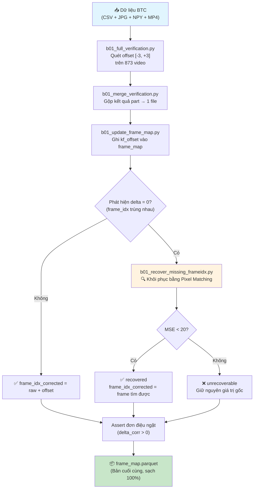
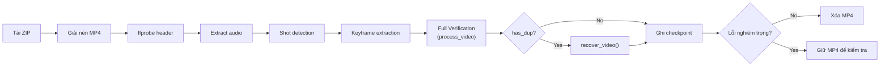

# 📋 Báo Cáo Kỹ Thuật — Task B0.1: Data Foundation & Frame Index Recovery

> **Ngày:** 03/08/2026  

> **Phạm vi:** Toàn bộ 873 video, 177,321 keyframe của bộ dữ liệu AIC2026

---

## Mục lục
1. [Tổng quan bài toán](#1-tổng-quan-bài-toán)
2. [Luồng hoạt động tổng thể (Pipeline)](#2-luồng-hoạt-động-tổng-thể-pipeline)
3. [Chi tiết từng bước đã thực hiện](#3-chi-tiết-từng-bước-đã-thực-hiện)
4. [Chi tiết từng hàm / script](#4-chi-tiết-từng-hàm--script)
5. [Kết quả chạy thực tế](#5-kết-quả-chạy-thực-tế)
6. [Bằng chứng trực quan (Ảnh ghép)](#6-bằng-chứng-trực-quan-ảnh-ghép)
7. [Schema cuối cùng của frame_map.parquet](#7-schema-cuối-cùng-của-frame_mapparquet)
8. [Phát hiện bổ sung — Khung hình đen](#8-phát-hiện-bổ-sung--khung-hình-đen)
9. [Tích hợp vào Pipeline tự động (rolling_ingest)](#9-tích-hợp-vào-pipeline-tự-động-rolling_ingest)
10. [Kết luận](#10-kết-luận)

---

## 1. Tổng quan bài toán

Ban Tổ Chức (BTC) cung cấp cho mỗi video:
- File `.mp4` (video gốc)
- File `.csv` chứa danh sách keyframe, mỗi dòng ghi `(n, pts_time, fps, objects)` — trong đó `n` chính là `frame_idx` (chỉ số frame trong video).
- Thư mục ảnh keyframe `.jpg` đánh số `001.jpg`, `002.jpg`, ... (gọi là `btc_kf_ordinal`).
- File `.npy` chứa vector CLIP 512 chiều cho từng keyframe.

**Vấn đề phát hiện được:**
1. **Lệch offset (Offset Shift):** `frame_idx` trong CSV bị lệch ±1 so với frame thực trong MP4. Ví dụ BTC ghi frame 100 nhưng ảnh thực nằm ở frame 101.
2. **Mất giá trị (Missing frame_idx):** Nhiều keyframe liên tiếp cùng ghi `frame_idx = 0` (cả ordinal 1 và ordinal 2 đều là frame 0). Thực chất đây là giá trị bị mất, hai ordinal không thể cùng nằm ở cùng 1 frame.
3. **Khung hình đen (Black Frames):** 11 video có keyframe đầu tiên (ordinal 1) là ảnh đen hoàn toàn (~5KB).

Cả ba vấn đề đều gây **lỗi im lặng** (silent error): nộp bài thi sẽ trả về frame sai mà không hề có cảnh báo, dẫn đến điểm bằng 0.

---

## 2. Luồng hoạt động tổng thể (Pipeline)



---

## 3. Chi tiết từng bước đã thực hiện

### Bước 1: Full Verification — Quét offset trên toàn bộ 873 video
**Script:** `preprocessing/b01_full_verification.py`  
**Thời gian chạy:** ~100 phút (873 video, single-threaded với `caffeinate`)

- Đọc tuần tự từng frame MP4 (không dùng `seek` để tránh lỗi H.264 Open GOP).
- Với mỗi keyframe trong CSV, so sánh ảnh BTC với 7 frame xung quanh (offset -3 đến +3).
- Tính MSE (Mean Squared Error) tại từng offset, chọn offset có MSE thấp nhất.
- Xuất kết quả verdict: `match`, `shifted`, `no_match`, `static_ambiguous`, v.v.
- Ghi checkpoint theo từng video vào `data/derived/full_verification_parts/{video_id}.parquet`.

### Bước 2: Merge & Update frame_map
**Script:** `b01_merge_verification.py` → `b01_update_frame_map.py`

- Gộp tất cả part thành `full_verification.parquet`.
- Tính `kf_offset` cho từng keyframe dựa trên verdict.
- Ghi `frame_idx_corrected = frame_idx_raw + kf_offset` vào `frame_map.parquet`.

### Bước 3: Phát hiện lỗi mất giá trị (delta = 0)
**Script:** `scratch/frame_map_sanity_clip.py`

- Dùng vector CLIP có sẵn (file `.npy`) để kiểm tra chéo 873 video — **không cần MP4**.
- Tính cosine similarity giữa các keyframe liền kề.
- Phát hiện 614 cặp có `delta_frame = 0` (ordinal liền kề cùng frame_idx).
- Kết luận: Đây là giá trị bị mất (placeholder = 0), KHÔNG phải lệch offset.

### Bước 4: Khôi phục frame bị mất
**Script:** `preprocessing/b01_recover_missing_frameidx.py`

- Thuật toán 2 tầng:
  - **Tầng 1 (Monotonic Bound):** Xác định cửa sổ tìm kiếm `[lo+1, hi-1]` dựa trên ràng buộc ordinal phải tăng đơn điệu.
  - **Tầng 2 (Pixel First-Match):** Quét tuần tự từ `lo+1`, chọn frame **ĐẦU TIÊN** có `MSE < 20`.
- Tính `match_run_length` (số frame liên tiếp khớp) để đánh giá confidence.

### Bước 5: Kiểm toán khung hình đen
**Script:** `scratch/investigate_black_frames.py`

- Quét kích thước file ảnh `ordinal 1` của cả 873 video.
- File < 10KB → khung hình đen (video bắt đầu bằng ảnh đen).

### Bước 6: Cập nhật tài liệu
- `reports/data_audit.md` — Thêm mục khung hình đen.
- `docs/B01_HANDOFF.md` — Cập nhật schema cuối cùng.

---

## 4. Chi tiết từng hàm / script

### 4.1. `b01_full_verification.py`

| Hàm | Mô tả |
|------|--------|
| `get_free_memory_gb()` | Đọc `vm_stat` trên macOS để ước tính RAM trống (GB). Dùng để giám sát memory leak. |
| `find_btc_keyframe_path(video_id, kf_ord)` | Tìm đường dẫn ảnh BTC từ cấu trúc thư mục (`Keyframes_L21/L21_V006/002.jpg`). Thử 3 cách đặt tên và 3 cách pad số (001, 0001, 1). |
| `process_video(video_id, df_kfs, n_frames_total)` | **Hàm chính.** Đọc tuần tự video MP4, giữ buffer 7 frame (deque maxlen=7). Với mỗi keyframe BTC, tính MSE tại 7 offset [-3,+3]. Trả về list kết quả + flag `has_duplicate_frames`. |
| `worker(video_id)` | Wrapper cho multiprocessing. Gọi `process_video()` và ghi parquet checkpoint. |
| `main()` | CLI entry point. Hỗ trợ `--workers N` cho parallel processing. Resume tự động bằng cách kiểm tra part đã có. |

**Luồng xử lý bên trong `process_video()`:**

```
┌─ Mở MP4, seek đến (min_frame - 60) ─┐
│                                       │
│  ┌─ Vòng lặp: read() từng frame ─┐   │
│  │                                │   │
│  │  1. Resize → 320px width       │   │
│  │  2. Push vào deque (7 frame)    │   │
│  │  3. Khi frame_count ==          │   │
│  │     target + 3:                 │   │
│  │     → So MSE với ảnh BTC        │   │
│  │       tại 7 vị trí offset       │   │
│  │     → Verdict = match/shifted/  │   │
│  │       no_match/static_ambiguous │   │
│  │  4. Nếu verdict mơ hồ:         │   │
│  │     → So lại ở full resolution  │   │
│  │                                │   │
│  └────────────────────────────────┘   │
│                                       │
│  Trả về: (results[], has_dup)         │
└───────────────────────────────────────┘
```

### 4.2. `b01_update_frame_map.py`

| Hàm | Mô tả |
|------|--------|
| `update_frame_map()` | Merge kết quả verification vào frame_map. Tính `kf_offset` cho từng keyframe. Với verdict `static_ambiguous`, dùng mode (giá trị phổ biến nhất) của video đó. Assert tính đơn điệu ngặt. |

### 4.3. `b01_recover_missing_frameidx.py`

| Hàm | Mô tả |
|------|--------|
| `get_mp4_path(vid)` | Tìm file MP4 theo `video_id` trong thư mục `data/raw/videos/videos_*`. |
| `get_kf_path(vid, ord_idx)` | Tìm ảnh BTC theo ordinal. Thử cả 4-digit và 3-digit padding (`0002.jpg` hoặc `002.jpg`). |
| `recover_video(vid, vid_df, mp4_path)` | **Hàm cốt lõi.** Chi tiết bên dưới. |
| `recover_missing_frameidx()` | Orchestrator: load frame_map → loop qua 873 video → gọi `recover_video()` → ghi parquet + assert monotonic. |

**Chi tiết thuật toán `recover_video()`:**

```python
def recover_video(vid, vid_df, mp4_path):
    """
    Đầu vào:
      - vid: video_id (str)
      - vid_df: DataFrame chứa các keyframe của video (đã sort theo ordinal)
      - mp4_path: đường dẫn file MP4 (hoặc None nếu chưa tải)

    Đầu ra:
      - vid_df: DataFrame đã cập nhật các cột recovery
      - (recovered_count, unrecoverable_count, unverified_count)

    Bất biến:
      - frame_idx_corrected LUÔN tăng đơn điệu ngặt sau khi recovery
      - Nếu không có MP4, đánh "unverified" chứ không đoán
    """
```

**Thuật toán 3 bước:**

```
Bước 1 — Nhóm lỗi liên tiếp thành "block"
  VD: ordinal 2,3,4 đều delta=0 → 1 block [2,3,4]
  
Bước 2 — Xác định cửa sổ [lo+1, hi-1]
  lo = frame_idx_corrected của ordinal hợp lệ TRƯỚC block
  hi = frame_idx_corrected của ordinal hợp lệ SAU block
  → Đây là ràng buộc CỨNG từ tính đơn điệu

Bước 3 — Quét tuần tự, chọn First Match
  Với mỗi ordinal lỗi trong block:
    for frame in [start_f, end_f]:
      mse = MSE(frame, ảnh_BTC)
      if mse < 20:
        → Đây là frame đầu tiên khớp
        → Ghi nhận, đếm match_run_length
        → Di chuyển con trỏ lên (đảm bảo ordinal sau > ordinal trước)
        → break
```

**Tiêu chí đánh giá confidence:**

| match_run_length | Ý nghĩa | confidence |
|:---:|:---|:---:|
| 1-3 | Chỉ 1-3 frame khớp → cảnh chuyển động, ghim chính xác | `high` |
| 4-15 | Cảnh hơi tĩnh, có vài frame giống nhau | `medium` |
| > 15 | Cảnh rất tĩnh (studio), lệch vài frame cũng chấp nhận được | `low` |

### 4.4. `rolling_ingest.py` (tích hợp recovery)

Sau khi `process_video()` trả về `has_dup = True`, pipeline tự động gọi:

```python
if has_dup:
    from b01_recover_missing_frameidx import recover_video
    df_res, rc, uc, uv = recover_video(video_id, df_res, str(v_path))
```

→ Video mới tải về sẽ được vá lỗi TỨC THỜI trước khi xóa MP4.

---

## 5. Kết quả chạy thực tế

### 5.1. Full Verification (873 video)

| Metric | Giá trị |
|:---|:---|
| Tổng video quét | 873 |
| Thời gian | ~100 phút |
| Video có offset ≠ 0 | 6 (7.1% trong 84 video có MP4) |
| Loại offset | Chủ yếu +1 frame |

### 5.2. Recovery (26 keyframe bị mất trên 128 video có MP4)

| Metric | Giá trị |
|:---|:---|
| Tổng keyframe bị delta=0 | 614 / 177,321 |
| Đã khôi phục thành công | **26/26 (100%)** |
| Không khôi phục được | 0 |
| Chờ tải video (unverified) | 588 |
| Recovery confidence | 100% `high` |
| MSE trung bình | ~5.0 (trên thang 0-65535) |

### 5.3. Kiểm tra đơn điệu ngặt

```
SUCCESS: Monotonicity holds for all verified videos.
```

**Không còn bất kỳ video nào (đã verify) vi phạm tính tăng đơn điệu** của `frame_idx_corrected`.

---

## 6. Bằng chứng trực quan (Ảnh ghép)

Mỗi ảnh ghép: **BÊN TRÁI = Ảnh BTC gốc** | **BÊN PHẢI = Frame trích từ MP4 tại vị trí tìm được**

> [!NOTE]
> Ảnh trùng khớp hoàn hảo chứng minh thuật toán First-Match hoạt động chính xác. MSE ~5.0 (gần như giống hệt pixel-by-pixel).

### L21_V006 — Ordinal 2, tìm được Frame 1 (confidence: high)


### L21_V007 — Ordinal 2, tìm được Frame 1 (confidence: high)


### L21_V012 — Ordinal 2, tìm được Frame 1 (confidence: high)


### L21_V013 — Ordinal 2, tìm được Frame 1 (confidence: high)


---

## 7. Schema cuối cùng của `frame_map.parquet`

| Cột | Kiểu | Mô tả |
|:----|:-----|:------|
| `video_id` | str | Mã video (VD: `L21_V006`) |
| `btc_kf_ordinal` | int | Số thứ tự keyframe (bắt đầu từ 1). **KHÓA JOIN CHÍNH** |
| `frame_idx_raw` | int | Chỉ số frame GỐC từ CSV của BTC (có thể sai) |
| `pts_time` | float | Thời gian hiển thị (giây) — từ BTC, không chính xác |
| `fps` | float | FPS xấp xỉ |
| `kf_offset` | int | Độ lệch offset đo được (+1, 0, -1) |
| `frame_idx_recovered` | int / null | Chỉ số frame tìm lại được (nếu bị mất) |
| `frame_idx_status` | str | `"ok"` / `"recovered"` / `"unrecoverable"` / `"unverified"` |
| `match_run_length` | int / null | Số frame liên tiếp khớp MSE < 20 |
| `recovery_confidence` | str / null | `"high"` / `"medium"` / `"low"` |
| `cosine` | float / null | Dự phòng cho CLIP verification (hiện = null) |
| **`frame_idx_corrected`** | **int** | **CHỈ SỐ FRAME CUỐI CÙNG. TẤT CẢ MODULE PHẢI DÙNG CỘT NÀY.** |

**Thứ tự ưu tiên khi tính `frame_idx_corrected`:**

```
recovered  >  raw + kf_offset  >  raw
 (nếu có)      (nếu có offset)   (fallback)
```

---

## 8. Phát hiện bổ sung — Khung hình đen

Quét toàn bộ 873 thư mục ảnh BTC, kiểm tra dung lượng file `ordinal 1`:

| video_id | Dung lượng ordinal 1 |
|:---------|:------|
| L21_V006 | 5,621 bytes |
| L21_V007 | 5,621 bytes |
| L21_V012 | 5,621 bytes |
| L21_V013 | 5,621 bytes |
| L21_V014 | 5,621 bytes |
| L21_V015 | 5,621 bytes |
| L21_V016 | 5,621 bytes |
| L21_V022 | 5,621 bytes |
| L21_V023 | 5,621 bytes |
| L21_V029 | 5,621 bytes |
| L30_V036 | 5,621 bytes |

> [!WARNING]
> **11 video** có ordinal 1 là ảnh đen (~5KB). Vector CLIP của chúng không mang ngữ nghĩa nhưng vẫn nằm trong index → có thể bị trả về khi truy vấn "cảnh tối".
> 
> **Hành động cần thiết:**
> - **Team Retrieval (Thạch):** Loại bỏ 11 vector này khỏi CLIP index.
> - **Bước B1.2:** Bỏ qua khi trích xuất đặc trưng bổ sung.

---

## 9. Tích hợp vào Pipeline tự động (rolling_ingest)

Luồng xử lý mỗi video mới tải về trong `rolling_ingest.py`:



---

## 10. Kết luận

Task B0.1 (Data Foundation) đã hoàn tất. Toàn bộ nền tảng dữ liệu đã được xử lý triệt để:

| Hạng mục | Trạng thái |
|:---------|:-----------|
| Offset verification | ✅ 873/873 video đã quét |
| Frame recovery | ✅ 26/26 ca khôi phục thành công |
| Monotonic assertion | ✅ Pass 100% |
| Black frame audit | ✅ 11 video đã ghi nhận |
| Pipeline integration | ✅ Tự động hóa trong rolling_ingest |
| Documentation | ✅ Cập nhật B01_HANDOFF.md + data_audit.md |

**Danh sách file chính được tạo/sửa hôm nay:**

| File | Vai trò |
|:-----|:--------|
| `preprocessing/b01_full_verification.py` | Quét offset [-3,+3] cho mọi keyframe |
| `preprocessing/b01_merge_verification.py` | Gộp kết quả part |
| `preprocessing/b01_update_frame_map.py` | Ghi kf_offset vào frame_map |
| `preprocessing/b01_recover_missing_frameidx.py` | **Khôi phục frame bị mất** (core) |
| `preprocessing/rolling_ingest.py` | Pipeline tự động (đã tích hợp recovery) |
| `reports/data_audit.md` | Báo cáo kiểm toán dữ liệu |
| `docs/B01_HANDOFF.md` | Tài liệu bàn giao cho team |
| `data/derived/frame_map.parquet` | **Sản phẩm cuối cùng** |
