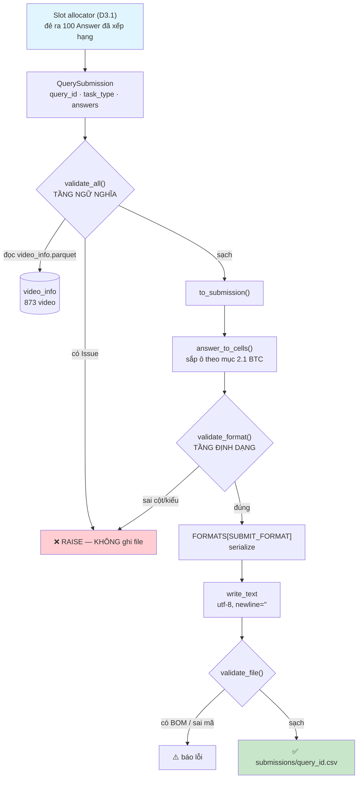

# 📋 Báo Cáo Kỹ Thuật — Task W0.2 + D0.2: Export & Validator

> **Ngày:** 06/08/2026 · **rà lại 10/08/2026**
>
> **Người thực hiện:** Minh Hoàng
>
> **Phạm vi:** Tầng sinh bài nộp — `data/config/submit_format.py` + `backend/export/` + `tests/`
>
> Đây là khâu **cuối cùng** của cả hệ thống: mọi công sức của 5 người kết thúc ở một file
> nộp cho BTC. Tầng này không tìm kiếm gì, nhưng nếu nó sai thì mọi thứ phía trước thành
> vô nghĩa — và sai kiểu **im lặng**: file vẫn mở được, vẫn đúng số dòng, chỉ là 0 điểm.

---

## Mục lục
1. [Tổng quan bài toán](#1-tổng-quan-bài-toán)
2. [Luồng hoạt động tổng thể](#2-luồng-hoạt-động-tổng-thể)
3. [Chi tiết từng bước đã thực hiện](#3-chi-tiết-từng-bước-đã-thực-hiện)
4. [Chi tiết từng hàm](#4-chi-tiết-từng-hàm)
5. [Bảy luật của validator](#5-bảy-luật-của-validator)
6. [Kết quả chạy thực tế](#6-kết-quả-chạy-thực-tế)
7. [`Answer.__post_init__` — chuẩn hoá `frame_ids`](#7-answer__post_init__--chuẩn-hoá-frame_ids-ở-cửa-vào)
8. [Đo độ trễ](#8-đo-độ-trễ)
9. [Đối chiếu với yêu cầu trong tài liệu](#9-đối-chiếu-với-yêu-cầu-trong-tài-liệu)
10. [Việc còn treo](#10-việc-còn-treo) — [10.1 ai gọi tầng này](#101-ai-gọi-tầng-này-và-gọi-thế-nào) · [10.2 phần đang giả định](#102-phần-đang-chạy-trên-giả-định--sẽ-phải-sửa) · [10.3 code thử nghiệm](#103--code-chỉ-để-thử-nghiệm--bỏ-khi-vào-thi)
11. [Kết luận](#11-kết-luận)

---

## 1. Tổng quan bài toán

### 1.1. Đầu ra cuối cùng của cả hệ thống

Mọi công sức của 5 người — tải data, trích keyframe, encode CLIP, search, RRF — đều
kết thúc ở một chỗ: **một file nộp cho BTC**. Tầng này là khâu cuối. Nó không tìm
kiếm gì, nhưng nếu nó sai thì mọi thứ phía trước thành vô nghĩa.

Theo tài liệu BTC *"Thông tin vòng Sơ tuyển"*, định dạng một câu trả lời:

| Dạng bài    | Định dạng trả lời (rᵢ)                      |
| :------------| :--------------------------------------------|
| Textual KIS | `<video_id>, <frame_id>`                    |
| Q&A         | `<video_id>, <frame_id>, <answer>`          |
| TRAKE       | `<video_id>, <frame_id₁>, ..., <frame_idₙ>` |

Mỗi truy vấn nộp **tối đa 100 câu trả lời**, và điểm là
`trung bình(R@1, R@5, R@20, R@50, R@100)`.

### 1.2. Ba vấn đề phải giải

**Vấn đề 1 — Bug `frame_id` (W0.2).** Bản cũ của `submit_format.py` suy `frame_id`
bằng cách cắt hậu tố `keyframe_id`:

```python
"L03_V001_0007".rsplit("_", 1)[-1]   →  "0007"
```

`0007` là **số thứ tự file keyframe trong thư mục**, không phải **frame index trong
video** mà BTC chấm. Keyframe thứ 7 có thể nằm ở frame 175 của video.

Đây là **lỗi im lặng** — loại nguy hiểm nhất: file nộp nhìn hợp lệ, không crash,
không cảnh báo, nhưng lệch hệ thống mọi câu → **0 điểm toàn giải dù tìm đúng video
đúng khoảnh khắc**.

**Vấn đề 2 — Chưa có tầng kiểm (D0.2).** Không có gì chặn giữa pipeline và file nộp.
Một bài nộp thiếu dòng, trùng dòng, hoặc `frame_id` vượt độ dài video sẽ đi thẳng
tới BTC.

**Vấn đề 3 — Chưa biết định dạng thật.** BTC chưa công bố CSV hay JSON, có header
không, `frame_id` đếm từ 0 hay 1. Không thể chờ, cũng không thể đoán rồi viết cứng.

---

## 2. Luồng hoạt động tổng thể



**Nguyên tắc chia tầng**:

| Tầng | File | Biết gì | KHÔNG biết gì |
|:---|:---|:---|:---|
| **Định dạng** | `data/config/submit_format.py` | tên cột, thứ tự ô, CSV/JSON | video có thật không, dài bao nhiêu |
| **Cơ chế** | `backend/export/exporter.py` | 100 dòng, `video_info`, frame hợp lệ | tên cột, dấu phẩy |

Chiều phụ thuộc **một hướng**: `export.py` → `submit_format.py`. Không có chiều ngược.

---

## 3. Chi tiết từng bước đã thực hiện

### Bước 1 — Gỡ bug `frame_id` tận gốc (W0.2)

Đã xoá hàm `_answer_value()`. Tầng định dạng giờ **không còn khả năng** tự tính ra
`frame_id` — nó chỉ ghi ra đúng con số nhận được. Trách nhiệm cấp `frame_idx` thật
chuyển lên slot allocator (D3.1), nơi đã có `frame_map`.

Khác biệt so với "vá": sau khi tầng format mất khả năng tính toán, bug này **không
thể tái diễn về mặt cấu trúc** — kể cả khi sau này có người viết lại module.

### Bước 2 — Đổi interface

```python
build_submission(query_id, task_type, answers: list[Answer])

@dataclass(frozen=True)
class Answer:
    video_id:    str
    frame_ids:   tuple[int, ...]     # TRAKE có N phần tử; KIS/Q&A có 1
    answer_text: str | None = None   # chỉ Q&A
    keyframe_id: str | None = None   # giữ để debug, KHÔNG dùng để tính
```

Ba quyết định đi kèm:
- **Bỏ hẳn trường `rank`.** Thứ hạng = thứ tự phần tử trong list. Giữ thêm `rank` là
  tạo nguồn sự thật thứ hai, sớm muộn cũng lệch với thứ tự thật.
- **Một hàm chung cho cả 3 dạng bài**, không tách 3 hàm.
- **`query_id` không xuất hiện trong file** — tài liệu BTC mục 2.1 không có cột đó.
  Nó chỉ dùng để đặt tên file, vì mỗi truy vấn là một file riêng.

### Bước 3 — Dựng kho định dạng, chuyển bằng đúng 1 dòng hằng

```python
FORMATS: dict[str, Callable] = {}

@register("csv_v0")
def _fmt_csv_v0(task_type, rows, n_frames_per_row) -> str: ...
```

Ba format đăng ký sẵn — **tất cả đều là phỏng đoán**, hậu tố `_v0` để không ai nhầm
là đã chốt:

| Tên | Hình dạng |
|:---|:---|
| `csv_v0` | CSV không header — sát nhất với mục 2.1 |
| `csv_header_v0` | CSV có dòng tên cột |
| `json_v0` | JSON, mảng object |

BTC công bố format thật → thêm 1 hàm, dán 1 dòng `@register`, đổi `SUBMIT_FORMAT`.
Không sửa gì khác — đúng yêu cầu *"format tách rời hoàn toàn khỏi pipeline"* của `BUILD_TASKS`.

⚠️ Cố ý **không** cho chọn format bằng tham số hàm. `BUILD_TASKS` chốt chữ ký
`build_submission(query_id, task_type, answers)` — đúng ba tham số. Lúc thi chỉ có một
định dạng đúng; biến nó thành tuỳ chọn là mở đường cho việc nộp nhầm format mà không ai
biết. Điểm chuyển duy nhất là hằng `SUBMIT_FORMAT`, và test
`test_build_submission_dung_3_tham_so` canh cho chữ ký không lệch lại.

### Bước 4 — Validator chia hai tầng


| Tầng | Kiểm gì | Ở đâu | Vì sao ở đó |
|:---|:---|:---|:---|
| Định dạng | đúng số cột, đúng kiểu dữ liệu | cạnh `submit_format.py` | không cần dữ liệu ngoài |
| Ngữ nghĩa | 100 dòng, frame hợp lệ, trùng lặp, TRAKE tăng dần | `export.py` | cần đọc `video_info.parquet` |

### Bước 5 — Ghi file an toàn trên Windows

```python
path.write_text(noi_dung, encoding="utf-8", newline="")
```

- `encoding="utf-8"` chứ **không phải** `utf-8-sig` → không chèn 3 byte BOM
- `newline=""` → Windows không đổi `\n` thành `\r\n`

### Bước 6 — Dựng hạ tầng test 

Đã dựng `tests/` ở gốc repo và thêm `pytest` vào `backend/requirements.txt`.

---

## 4. Chi tiết từng hàm

### 4.1. `data/config/submit_format.py`

| Hàm / lớp | Mô tả |
|:---|:---|
| `Answer` | Một câu trả lời. `frozen=True` → hashable → luật kiểm trùng lặp chỉ cần `set()`. |
| `Answer.__post_init__()` | **Chốt an toàn ở cửa vào.** Chuẩn hoá `frame_ids` về `tuple[int]` bằng `operator.index()`. |
| `answer_to_cells()` | `Answer` → list ô, đúng thứ tự cột BTC mục 2.1. Không tính toán, chỉ sắp xếp. |
| `register(name)` | Decorator đăng ký bộ ghi vào `FORMATS`. |
| `_fmt_csv_v0` · `_fmt_csv_header_v0` · `_fmt_json_v0` | Ba bộ ghi phỏng đoán. |
| `build_submission()` | **Cửa vào duy nhất.** Sắp ô → kiểm định dạng → serialize. |
| `suggest_filename()` | Tên file cho một truy vấn. `TODO: BTC` — quy ước chưa công bố. |
| `validate_format()` | Validator tầng định dạng: số cột nhất quán, `frame_id` là số nguyên, `video_id` khác rỗng. |

### 4.2. `backend/export/exporter.py`

| Hàm / lớp | Mô tả |
|:---|:---|
| `QuerySubmission` | Bài nộp của MỘT truy vấn: `query_id`, `task_type`, `answers`. Thứ tự = thứ hạng. |
| `Issue` | Một lỗi. `rule` là slug ổn định để test bám vào, không bám câu chữ tiếng Việt. `__str__` in `query_id` và `position` **độc lập nhau** — Issue chỉ có `position` vẫn giữ được số thứ hạng. |
| `_video_frames()` | `video_id → n_frames`, đọc `video_info.parquet`. `@lru_cache` → đọc đĩa đúng 1 lần cho cả tiến trình. |
| `all_video_ids()` · `n_frames_of()` | Hai hàm tra cứu công khai, dùng chung cache trên. |
| `validate_submission()` | Kiểm ngữ nghĩa một truy vấn. Trả `list[Issue]`, **không raise**. |
| `validate_all()` | Kiểm nhiều truy vấn, kèm phát hiện `query_id` trùng. |
| `_check_duplicates()` | Hai câu trả lời trùng nội dung = tiêu hai slot mà chỉ mua một cơ hội. |
| `_check_shape()` | Số frame theo dạng bài · TRAKE tăng dần ngặt · Q&A có `answer`. |
| `_check_video_and_frames()` | `video_id` tồn tại · `frame_id ∈ [0, n_frames)`. |
| `validate_file()` | Kiểm file đã ghi: UTF-8 · không BOM · **không CRLF** · không rỗng. Báo kèm số dòng dính CRLF. |
| `format_issues()` | Gom lỗi thành báo cáo đọc được, nhóm theo luật. |
| `to_submission()` | Uỷ quyền toàn bộ định dạng cho `submit_format`. |
| `write_submissions()` | Ghi **mỗi truy vấn một file**. Mặc định validate trước, sai thì không ghi. |
| `_demo_subs()` · `main()` | CLI `--demo`: lấy shot thật từ `shots.parquet` → **`backend.slot.allocate()`** cấp frame → tự kiểm. Xem mục 6.4. |

**Vì sao validator trả `list[Issue]` thay vì raise ngay lỗi đầu tiên:**

D6.1 (preflight check) cần in **toàn bộ** lỗi một lượt. Raise từng cái nghĩa là sửa
một lỗi → chạy lại → lòi lỗi tiếp → sửa → chạy lại. Trước hạn nộp thì đó là công
thức trượt hạn.

---

## 5. Bảy luật của validator


| # | Luật | Tầng | Slug `Issue` |
|:---:|:---|:---|:---|
| 1 | Đúng 100 dòng mỗi truy vấn | ngữ nghĩa | `answer_count` |
| 2 | `video_id` tồn tại | ngữ nghĩa | `video_unknown` |
| 3 | `frame_id ∈ [0, n_frames)` | ngữ nghĩa | `frame_out_of_range` |
| 4 | Không dòng trùng lặp hoàn toàn | ngữ nghĩa | `duplicate_answer` |
| 5 | TRAKE đúng N frame, **tăng dần ngặt** | ngữ nghĩa | `trake_not_increasing`, `trake_n_inconsistent`, `trake_n_mismatch` |
| 6 | Q&A có `answer` không rỗng | ngữ nghĩa | `answer_empty` |
| 7 | File UTF-8, **không BOM, không CRLF** | file | `bom`, `not_utf8`, `crlf` |

Kèm bốn luật phụ phát sinh khi cài đặt: `task_type` hợp lệ · `query_id` không trùng ·
KIS/Q&A đúng 1 frame · dạng không phải Q&A thì không được có `answer`.

> [!NOTE]
> **Quyết định thiết kế:** gặp `video_id` không có trong `video_info.parquet` thì
> **báo lỗi**, tuyệt đối không lặng lẽ bỏ qua. Bỏ qua = cho trôi dòng sai mà không ai
> biết — đúng loại lỗi im lặng mà cả dự án đang phòng.

### Vì sao luật 7 phải nằm trong validator, không chỉ nằm trong test

`write_submissions()` ghi bằng `newline=""` nên file **nó** sinh ra luôn dùng LF — test
đọc byte và xác nhận điều đó. Nhưng D6.1 (preflight) chạy `validate_file()` lên **file
cuối cùng trước khi nộp**, mà file đó có thể do UI, script tay, hoặc một lần copy qua
PowerShell ghi ra. Nếu luật chỉ sống trong test thì con đường đó không ai canh.

```
b"L21_V001,100\r\n..."   →  crlf: có 2 dòng kết thúc bằng CRLF — phải ghi LF
b"L21_V001,100\r..."     →  crlf: có 2 ký tự \r đơn lẻ — phải ghi LF
b"L21_V001,100\n..."     →  []   (LF thuần: im lặng)
```

Báo kèm **số dòng dính** để phân biệt "một dòng lẻ bị dán vào" với "cả file sai
newline" — hai thứ này cần hai cách xử lý khác nhau. `\r` đơn lẻ (newline kiểu Mac cổ)
cũng bị bắt, vì nó không lộ ra khi mở file bằng mắt.

---

## 6. Kết quả chạy thực tế

### 6.1. Bộ test

```
66 test của D0.2 — 100% xanh
  tests/test_validator.py : 34 test
  tests/test_export.py    : 32 test

(cả repo 106 test: + 40 test của D3.1, xem reports/D31_TECHNICAL_REPORT.md.
 3 test đỏ nằm ở D3.1, do backend/indexing/frame_map.py gãy — mục 10.1)
```

Mỗi luật có **1 ca đúng + ít nhất 1 ca sai**. Ca sai mới là thứ chứng minh validator
hoạt động — một hàm luôn trả `[]` cũng pass mọi ca đúng.

**Không dùng mock, không bịa số.** Toàn bộ dữ liệu test lấy từ parquet của Data Factory:

| Thành phần | Nguồn |
|:---|:---|
| `video_id`, `n_frames` | `video_info.parquet` — 873 video |
| `frame_id` | cột `frame_idx` (đã bù offset) của `frame_map.parquet` — 177.321 keyframe |
| TRAKE N frame | N keyframe **liên tiếp** thật, vốn đã tăng dần ngặt |
| **Thứ tự** 100 câu trả lời | `backend.slot.allocate()` của D3.1 — xem mục 6.4 |

### 6.2. Hai test quét toàn bộ dữ liệu thật

| Test | Phạm vi |
|:---|:---|
| `test_moi_keyframe_that_deu_qua_duoc_luat_bien` | **177.321 keyframe / 873 video** — không keyframe nào được vượt `n_frames` của video nó |
| `test_validator_khong_bao_nham_tren_20_video_that` | Dựng bài nộp thật từ 20 video, chạy đúng đường code lúc thi → validator phải im lặng hết |

Test đầu bắt được nếu Data Factory giao ra dữ liệu lệch. Test sau bắt được nếu
validator báo nhầm trên dữ liệu đúng — cả hai đều phải biết trước ngày nộp.

### 6.3. Kiểm chứng bằng cách phá code

Test chỉ đáng tin nếu nó **đỏ khi code sai**. Đã thử phá:

| Phá gì | Kết quả |
|:---|:---|
| Đổi `a >= b` thành `a > b` (bỏ "tăng dần **ngặt**") | 1 test đỏ |
| Tắt luật đếm 100 dòng (`if False:`) | 3 test đỏ |
| Phục hồi | 66 xanh |

Đổi **một ký tự** `=` mà test bắt được ngay.

### 6.4. File nộp sinh ra — cũng là phép thử đầu-cuối với D3.1

`--demo` không tự tính frame. Nó lấy shot thật từ `shots.parquet`, đưa qua
`backend.slot.allocate()` (D3.1), rồi mới kiểm và ghi. Nghĩa là mỗi lần chạy demo là
một lần **chạy thật cả hai tầng nối nhau**: allocator đẻ ra thứ mà chính validator của
mình từ chối thì lộ ngay tại đây, không phải đợi tới ngày nộp.

```
$ python -m backend.export --demo

== Kiểm ngữ nghĩa ==
HỢP LỆ — không phát hiện lỗi nào.

== Đã ghi 3 file vào submissions\demo_csv_v0 ==
   kis_001.csv    (1273 byte)
   qa_001.csv     (1473 byte)
   trake_001.csv  (2404 byte)
== Kiểm file ==
HỢP LỆ — không phát hiện lỗi nào.
```

Nội dung — khớp đúng mục 2.1 của BTC:

```
kis_001.csv     L21_V001,34        ← shot hạng 1
                L21_V001,350       ← shot hạng 2   (xen kẽ, không gom theo shot)
                L21_V002,46        ← shot hạng 4
qa_001.csv      L21_V001,34,5
trake_001.csv   L21_V001,34,35,350,388
```

Kiểm byte: `BOM: False` · `CRLF: False`.

> [!NOTE]
> Import `backend.slot` đặt **trong hàm** `_demo_subs()`, không ở đầu file: `allocator.py`
> import ngược lại `backend.export` (`REPO_ROOT`, `n_frames_of`), để ở đầu file là vòng
> import.

### 6.5. Validator bắt lỗi thật

Cố tình phá 4 chỗ trong dữ liệu:

```
[video_unknown]        video_id 'L99_V999' không có trong video_info.parquet
[frame_out_of_range]   frame_id -5 nằm ngoài [0, 37849) của video L21_V001
[trake_not_increasing] frame phải tăng dần ngặt, đang là (900, 100, 200, 300)
[answer_count]         có 99 câu trả lời, phải đúng 100
```

Bắt đủ 4, **báo một lượt** chứ không dừng ở lỗi đầu tiên.

---

## 7. `Answer.__post_init__` — chuẩn hoá `frame_ids` ở cửa vào

`Answer` nhận `frame_ids` từ slot allocator, mà allocator tính frame từ `shots.parquet`
bằng pandas. Hai kiểu dữ liệu đi vào đây mà nếu không chuẩn hoá sẽ hỏng:

| Đầu vào | Không chuẩn hoá thì |
|:---|:---|
| `[100, 103]` — `BUILD_TASKS` ghi kiểu là `list[int]` | `TypeError: unhashable type: 'list'` khi validator so trùng. Crash bẩn, vỡ đúng bất biến "không ném exception vì dữ liệu sai" |
| `numpy.int64(100)` | `isinstance(np.int64(100), int)` là `False` → báo "frame_id phải là số nguyên, đang là int64". Báo lỗi sai trên dữ liệu đúng |

```python
def __post_init__(self) -> None:
    chuan = tuple(operator.index(f) for f in self.frame_ids)
    object.__setattr__(self, "frame_ids", chuan)
```

| Đầu vào | Kết quả | |
|:---|:---|:---|
| `[100, 103]` (list) | `(100, 103)` | ✅ nhận |
| `numpy.int64(100)` | `100` (int thuần) | ✅ nhận |
| `100.7` (float) | `TypeError` | ✅ **từ chối** |

> [!WARNING]
> Dùng `operator.index()` chứ **không** dùng `int()`. `int(100.7)` sẽ âm thầm ra `100`
> — đó chính là "tầng format tự tính", điều W0.2 cấm tuyệt đối. `operator.index()` chỉ
> nhận thứ chuyển sang số nguyên **không mất mát**.

Ba test chốt: `test_nhan_frame_ids_dang_list`, `test_nhan_numpy_int`,
`test_tu_choi_float_khong_lam_tron_ho`.

---

## 8. Đo độ trễ

| Thao tác | Thời gian |
|:---|---:|
| Nạp `video_info.parquet` (1 lần cho cả tiến trình) | 0.95 – 1.9 s |
| Validate + sinh file, 1 truy vấn 100 dòng | **0.20 ms** |
| Validate + ghi đĩa, 3 truy vấn | 7 – 9 ms |

Con số nạp parquet dao động theo cache của hệ điều hành (đo 3 lần liên tiếp: 1286 /
1123 / 951 ms). Nó là chi phí **một lần**, trả lúc khởi động chứ không lúc bấm nộp —
`@lru_cache(maxsize=1)` khiến mọi lần gọi sau đọc thẳng từ RAM:

```
cache: misses=1, hits=980 · cùng một object trong RAM
```

Việc thực sự chạy mỗi lần nộp là **0.20 ms**. Tầng này không phải chỗ nghẽn.

---

## 9. Đối chiếu với yêu cầu trong tài liệu

### 9.1. `BUILD_TASKS.md` — D0.2

| Yêu cầu | |
|:---|:---:|
| `build_submission(query_id, task_type, answers: list[Answer])` | ✅ |
| `Answer` = `video_id`, `frame_ids`, `answer_text`, `keyframe_id` | ✅ |
| Thứ hạng = thứ tự phần tử, không truyền `rank` | ✅ |
| Một hàm chung cho cả 3 dạng bài | ✅ |
| Validator *định dạng* cạnh `submit_format.py` | ✅ |
| Validator *ngữ nghĩa* trong `export.py` | ✅ |
| 7 luật validator | ✅ |
| Format tách rời hoàn toàn, đổi = 1 dòng `SUBMIT_FORMAT` | ✅ |

### 9.2. `BUILD_TASKS.md` — W0.2

| Yêu cầu | |
|:---|:---:|
| Xoá **hẳn** mọi phép tính khỏi tầng format | ✅ |
| Thiếu `frame_idx` → raise rõ ràng, tuyệt đối không đoán | ✅ |
| Trách nhiệm cấp `frame_idx` chuyển lên D3.1 | ✅ |

### 9.3. `CLAUDE.md`

| Yêu cầu | |
|:---|:---:|
| Bất biến 5 — `frame_id` là frame index trong video | ✅ |
| Comment "vì sao chọn cách này", tiếng Việt | ✅ |
| Thứ chưa chốt → để `data/config/` kèm `# TODO: BTC` | ✅ |
| Nợ kỹ thuật #5 — thêm `tests/` | ✅ |

### 9.4. Ba chỗ lệch so với chữ trong tài liệu

| Chỗ lệch | Lý do |
|:---|:---|
| `to_submission(rows, fmt)` → `to_submission(sub: QuerySubmission)` | Tài liệu BTC bắt mỗi truy vấn một file → hàm phải biết `query_id` và `task_type`. Bỏ `fmt` để `build_submission` giữ đúng 3 tham số như `BUILD_TASKS` chốt |
| `frame_ids: list[int]` → lưu thành `tuple` | `list` không hashable. Vẫn **nhận** list ở cửa vào (mục 7.3) |
| `keyframe_id: str` → `str \| None` | `BUILD_TASKS` D3.1 nói frame phát ra không cần là keyframe đã index → phần lớn dòng sẽ không có |

---

## 10. Việc còn treo

Task này làm sớm hơn tiến độ chung nên một số chỗ chạy trên giả định. Mục 10.2 nói rõ
chỗ nào có thể lệch khi BTC công bố định dạng thật.

| # | Việc | Chủ | Ảnh hưởng |
|:---:|:---|:---|:---|
| 1 | ~~`backend/indexing/frame_map.py` import module đã bị xoá khỏi git~~ | **Công Lý** | ✅ **Đã thông 13/08** — toàn bộ test xanh trở lại, xem `D31_TECHNICAL_REPORT.md` §10.5 |
| 2 | Định dạng nộp thật của BTC | **Linh** → BTC | Thêm 1 hàm vào `FORMATS` là xong — chi tiết mục 10.2 |
| 3 | Ai gọi tầng này thì phải đưa `list[QuerySubmission]`, không phải `dict` | — | 🟡 **đã xảy ra một lần** — `run_evaluation.py` gọi `write_submissions(dict)` và nổ ở dòng cuối cùng của cả lần chạy. Sửa 16/08, xem `D31_TECHNICAL_REPORT.md` §10.1 |

### 10.1. Ai gọi tầng này, và gọi thế nào

Tầng nộp bài có **hai đường vào**, cả hai đều đi qua `write_submissions()` chứ không gọi
thẳng `build_submission()` — nhờ vậy 7 luật validator và quy tắc "mỗi truy vấn một file"
chỉ cài đặt ở một chỗ.

| Đường | Ai gọi | Số dòng | Ai cấp `frame_idx` |
|:---|:---|:---:|:---|
| **Nộp thật** | orchestrator → slot allocator (D3.1) | ép đủ 100 | `allocate()` tra `frame_map` |
| **Thử tay** | `POST /submit` ← UI (`backend/api/main.py`) | vài dòng đã đánh dấu | endpoint tự tra `frame_map` rồi dựng `Answer` |

Điểm chung bắt buộc của cả hai: **tầng gọi tra bảng, tầng format thì không.** Đó là
thiết kế chống tái diễn bug W0.2 — `build_submission()` không nhận `frame_map` và sẽ
không bao giờ nhận, nên không đường nào có thể lén đưa việc suy `frame_id` xuống lại.

Đường thử tay được phép nộp **ít hơn 100 dòng** (`expect_answers=len(answers)`): người
vận hành chỉ đánh dấu vài frame để xem file trông ra sao. Đường nộp thật mới ép đủ 100 —
luật đó thuộc về allocator, không thuộc về tầng ghi file.

> [!WARNING]
> Ghi file trên Windows phải có `newline=""`, nếu không Python dịch `\n` → `\r\n`:
> ```
> write_text(..., encoding="utf-8")             → b'a\r\nb\r\n'
> write_text(..., encoding="utf-8", newline="") → b'a\nb\n'
> ```
> Đây là **lỗi im lặng** — file vẫn mở được bằng mắt. `write_submissions()` xử lý sẵn,
> và `validate_file()` bắt lại lần nữa (luật 7) cho những file do đường khác ghi ra.

### 10.2. Phần đang chạy trên GIẢ ĐỊNH — sẽ phải sửa

| #   | Chỗ                                                      | Đang giả định gì                            | Chờ ai         | Nếu sai thì sao                                                                              |
| :---:| :---------------------------------------------------------| :--------------------------------------------| :---------------| :---------------------------------------------------------------------------------------------|
| 1   | `SUBMIT_FORMAT = "csv_v0"`                               | BTC nhận CSV không header                   | **Linh** → BTC | Sửa **đúng một dòng**. Ba format đã đăng ký sẵn                                              |
| 2   | `_header_for()` tên cột `video_id`, `frame_id`, `answer` | Chỉ dùng khi BTC đòi header                 | **Linh** → BTC | Không dùng thì không ảnh hưởng                                                               |
| 3   | `suggest_filename()` = `"<query_id>.<đuôi>"`             | Quy ước đặt tên file                        | **Linh** → BTC | Đặt sai tên file có thể bị loại bài — **cần hỏi sớm**                                        |
| 4   | `frame_id` đếm từ **0**                                  | `[0, n_frames)` như frame index trong video | **Linh** → BTC | Nếu BTC đếm từ 1 thì **lệch hệ thống mọi câu**. Ca lỗi im lặng nguy hiểm nhất |
| 5   | ~~`expect_answers = 100`~~                               | Tối đa 100 đáp án mỗi truy vấn              | —              | ✅ **Đã chốt** — tài liệu BTC mục 2 |
| 6   | `video_id` ghi **không có đuôi** (`L21_V001`)            | BTC nhận id trần                            | **Linh** → BTC | 🔴 **MỚI 16/08** — xem dưới |

#### ⚠️ Điểm 6 — `video_id` có đuôi `.mp4` không? (phát hiện khi đọc kỹ tài liệu BTC)

Tài liệu BTC mục 1.1 và 1.2 viết ví dụ kết quả nộp là:

```
video_id = video_abc(.mp4), frame_id = 1500
video_id = video_xyz(.mp4), frame_id = 3450, answer = "5"
```

Dấu ngoặc quanh `.mp4` **không nói rõ** là tuỳ chọn hay bắt buộc. Tầng này đang ghi
nguyên `video_id` như trong `shots.parquet`, tức **không đuôi** (`L21_V001`).

Nếu BTC đòi `L21_V001.mp4` thì **sai toàn bộ bài nộp** — mà `validate_submission()` vẫn
báo hợp lệ, vì luật `video_unknown` tra đúng cái bảng dùng id trần. Cùng hạng nguy hiểm
với điểm 4, và **rẻ hơn nhiều để sửa nếu biết trước** (một dòng trong `answer_to_cells`).

→ Đã ghi `# TODO: BTC` ngay trong `data/config/submit_format.py`. **Hỏi cùng lượt với
điểm 4.**

#### ✅ Ba thứ tài liệu BTC ĐÃ chốt (rà lại 16/08)

| Thứ | Nguồn |
|:---|:---|
| Thứ tự ô: `<video_id>, <frame_id>` · Q&A thêm `answer` ở **cuối** · TRAKE nhiều `frame_id` | mục 2.1.1–2.1.3 |
| `answer` chấp nhận **tiếng Việt hoặc tiếng Anh** | mục 1.2 |
| Tối đa **100** câu trả lời mỗi truy vấn | mục 2 |

Ba thứ này khớp đúng thứ `answer_to_cells()` đang sinh ra — không phải sửa gì.

**Điểm 4 và 6 là hai thứ duy nhất còn lại có thể làm 0 điểm toàn giải mà không báo
lỗi.** Cả hai đều chỉ BTC trả lời được.

---

### 10.3. 🧪 Code chỉ để thử nghiệm — bỏ khi vào thi

> Liệt kê để sau này không ai tưởng nhầm là code sản xuất.

| # | Chỗ | Là gì | Xử lý |
|:---:|:---|:---|:---|
| 1 | `_demo_subs()` + cờ `--demo` | Dựng shot ứng viên **giả lập** từ `shots.parquet` rồi đưa qua allocator thật | **Giữ tới G2** — chạy được cả hai tầng mà không cần Milvus/ES. Không nằm trong đường chạy lúc thi |
| 2 | `write_submissions(..., validate=False)` | Đường thoát ghi dữ liệu hỏng ra soi | ⚠️ **TUYỆT ĐỐI không dùng ngày nộp.** Mặc định `True`; đặt `False` là sinh ra file trông hợp lệ mà sai |
| 3 | `csv_header_v0` · `json_v0` | Hai trong ba format là **phỏng đoán dự phòng** | BTC chốt → **xoá hai cái không dùng**. Để lại ba cái là để lại ba cách nộp sai |
| 4 | `build_submission` kiểm `fmt not in FORMATS` | Chốt chặn cho lúc gõ nhầm tên format | Giữ — rẻ và bắt được lỗi cấu hình |
| 5 | `tests/conftest.py` — `build_sub()`, `frames_of()`, `replace_answer()`, `cat_bot()` | Dựng dữ liệu test | Nằm trong `tests/`, không bao giờ chạy lúc thi |

**Điểm 2 và 3 là hai chỗ dễ gây tai nạn nhất** — cả hai đều tạo ra file nộp *trông* hợp
lệ mà sai.

---

---

## 11. Kết luận

| Hạng mục | Trạng thái |
|:---|:---|
| Bug `frame_id` (W0.2) | ✅ Gỡ tận gốc, không phải vá |
| Interface `build_submission` theo chốt của Thạch | ✅ |
| 7 luật validator | ✅ Đủ, chia đúng hai tầng |
| Kho định dạng chuyển bằng 1 dòng hằng | ✅ 3 format phỏng đoán đăng ký sẵn |
| File nộp đúng mục 2.1 của BTC | ✅ Đã sinh và kiểm byte |
| UTF-8 không BOM, không CRLF | ✅ Luật nằm trong `validate_file()`, không chỉ nằm trong test — mục 5 |
| Nối với slot allocator (D3.1) | ✅ `--demo` chạy thật cả hai tầng nối nhau — mục 6.4 |
| Hạ tầng test cho repo | ✅ 66 test (2 test quét toàn bộ 177.321 keyframe thật), kiểm chứng bằng cách phá code |
| Hai bug tiềm ẩn của D3.1 | ✅ Chặn trước khi nổ — mục 7 |

### Danh sách file được tạo / sửa

| File | Vai trò | Dòng |
|:---|:---|---:|
| `data/config/submit_format.py` | **Tầng định dạng** — viết lại toàn bộ | 235 |
| `backend/export/exporter.py` | **Tầng cơ chế** — tạo mới | 495 |
| `backend/export/__init__.py` · `__main__.py` | Đóng gói thành package, theo kiểu `backend/llm/` | 34 · 8 |
| `tests/conftest.py` | Dựng dữ liệu test từ `video_info` + `frame_map` thật | 178 |
| `tests/test_validator.py` | 34 test cho validator | 271 |
| `tests/test_export.py` | 32 test cho định dạng + ghi file | 296 |
| `backend/requirements.txt` | Thêm `pandas`, `pyarrow`, `pytest` | +6 |

**Đã xoá:** `backend/frame_lookup.py`, `backend/validator.py` — gộp vào `export.py`
sau khi rà thấy 3/6 hàm không có nơi nào gọi.

### Cách chạy / kiểm

```powershell
python -m pytest tests/test_export.py tests/test_validator.py -q   # 66 passed (D0.2)
python -m pytest tests dev_set/tests -q                            # 409 passed (16/08)
python -m backend.export --demo              # sinh file nộp mẫu qua allocator thật
```

> Bản 10/08 ghi *"103 passed, 3 failed — 3 đỏ ở `backend/indexing/frame_map.py`"*. Đã
> thông. Lưu ý `python -m pytest -q` trần vẫn **gãy lúc thu thập** vì
> `preprocessing/test_opencv_parity.py` cần gói `yaml` chưa cài — không liên quan tầng
> nộp bài, nhưng nó chặn cả lượt chạy nên nhớ chỉ định thư mục như trên.

### Task tiếp theo

**D3.1 — Slot allocator**: xem `reports/D31_TECHNICAL_REPORT.md`. Đó là nơi chịu trách
nhiệm cấp `frame_idx` thật mà tầng format đã từ chối tự tính.

**D6.1 — Preflight check** (19→20/08) là chỗ tiêu thụ chính của tầng này: nó gọi
`validate_all()` + `validate_file()` lên toàn bộ bài nộp cuối cùng và in một bảng
ĐẠT/KHÔNG ĐẠT. Đó cũng là lý do validator trả `list[Issue]` thay vì raise.

Tiếp theo: **D4.1 — chỉnh bảng `SLOT_BUDGET` theo dev set** (17→19/08).
