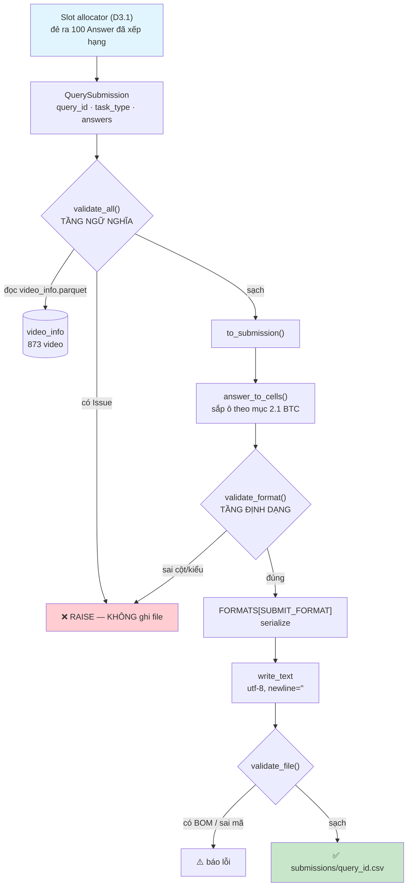

# 📋 Báo Cáo Kỹ Thuật — Task W0.2 + D0.2: Export & Validator

> **Ngày:** 06/08/2026
>
> **Người thực hiện:** Minh Hoàng
>
> **Phạm vi:** Tầng sinh bài nộp — `data/config/submit_format.py` + `backend/export/` + `tests/`
>
> ⚠️ **Cập nhật 07/08:** `backend/export.py` đã được đóng gói thành package `backend/export/`
> (`__init__.py` + `__main__.py` + `exporter.py`), theo đúng kiểu `backend/llm/` của Thạch.
> Đường import `backend.export` **không đổi** — mọi ví dụ code dưới đây vẫn đúng nguyên văn.

---

## Mục lục
1. [Tổng quan bài toán](#1-tổng-quan-bài-toán)
2. [Luồng hoạt động tổng thể](#2-luồng-hoạt-động-tổng-thể)
3. [Chi tiết từng bước đã thực hiện](#3-chi-tiết-từng-bước-đã-thực-hiện)
4. [Chi tiết từng hàm](#4-chi-tiết-từng-hàm)
5. [Bảy luật của validator](#5-bảy-luật-của-validator)
6. [Kết quả chạy thực tế](#6-kết-quả-chạy-thực-tế)
7. [Hai bug phát hiện trong lúc rà soát](#7-hai-bug-phát-hiện-trong-lúc-rà-soát)
8. [Đo độ trễ](#8-đo-độ-trễ)
9. [Đối chiếu với yêu cầu trong tài liệu](#9-đối-chiếu-với-yêu-cầu-trong-tài-liệu)
10. [Việc còn treo](#10-việc-còn-treo) — [10.1 lệch ở `POST /submit`](#101-chi-tiết-lệch-ở-post-submit-đã-báo-thạch) · [10.2 phần đang giả định](#102-phần-đang-chạy-trên-giả-định--sẽ-phải-sửa) · [10.3 code thử nghiệm](#103--code-chỉ-để-thử-nghiệm--bỏ-khi-vào-thi) · [**10.4 vấn đề còn trong code**](#104--vấn-đề-còn-trong-code--rà-lại-0708)
11. [Kết luận](#11-kết-luận)

---

## 1. Tổng quan bài toán

### 1.1. Đầu ra cuối cùng của cả hệ thống

Mọi công sức của 5 người — tải data, trích keyframe, encode CLIP, search, RRF — đều
kết thúc ở một chỗ: **một file nộp cho BTC**. Tầng này là khâu cuối. Nó không tìm
kiếm gì, nhưng nếu nó sai thì mọi thứ phía trước thành vô nghĩa.

Theo tài liệu BTC *"Thông tin vòng Sơ tuyển"*, định dạng một câu trả lời:

| Dạng bài    | Định dạng trả lời (rᵢ)                      |
| :------------| :--------------------------------------------|
| Textual KIS | `<video_id>, <frame_id>`                    |
| Q&A         | `<video_id>, <frame_id>, <answer>`          |
| TRAKE       | `<video_id>, <frame_id₁>, ..., <frame_idₙ>` |

Mỗi truy vấn nộp **tối đa 100 câu trả lời**, và điểm là
`trung bình(R@1, R@5, R@20, R@50, R@100)`.

### 1.2. Ba vấn đề phải giải

**Vấn đề 1 — Bug `frame_id` (W0.2).** Bản cũ của `submit_format.py` suy `frame_id`
bằng cách cắt hậu tố `keyframe_id`:

```python
"L03_V001_0007".rsplit("_", 1)[-1]   →  "0007"
```

`0007` là **số thứ tự file keyframe trong thư mục**, không phải **frame index trong
video** mà BTC chấm. Keyframe thứ 7 có thể nằm ở frame 175 của video.

Đây là **lỗi im lặng** — loại nguy hiểm nhất: file nộp nhìn hợp lệ, không crash,
không cảnh báo, nhưng lệch hệ thống mọi câu → **0 điểm toàn giải dù tìm đúng video
đúng khoảnh khắc**.

**Vấn đề 2 — Chưa có tầng kiểm (D0.2).** Không có gì chặn giữa pipeline và file nộp.
Một bài nộp thiếu dòng, trùng dòng, hoặc `frame_id` vượt độ dài video sẽ đi thẳng
tới BTC.

**Vấn đề 3 — Chưa biết định dạng thật.** BTC chưa công bố CSV hay JSON, có header
không, `frame_id` đếm từ 0 hay 1. Không thể chờ, cũng không thể đoán rồi viết cứng.

---

## 2. Luồng hoạt động tổng thể



**Nguyên tắc chia tầng**:

| Tầng | File | Biết gì | KHÔNG biết gì |
|:---|:---|:---|:---|
| **Định dạng** | `data/config/submit_format.py` | tên cột, thứ tự ô, CSV/JSON | video có thật không, dài bao nhiêu |
| **Cơ chế** | `backend/export/exporter.py` | 100 dòng, `video_info`, frame hợp lệ | tên cột, dấu phẩy |

Chiều phụ thuộc **một hướng**: `export.py` → `submit_format.py`. Không có chiều ngược.

---

## 3. Chi tiết từng bước đã thực hiện

### Bước 1 — Gỡ bug `frame_id` tận gốc (W0.2)

Đã xoá hàm `_answer_value()`. Tầng định dạng giờ **không còn khả năng** tự tính ra
`frame_id` — nó chỉ ghi ra đúng con số nhận được. Trách nhiệm cấp `frame_idx` thật
chuyển lên slot allocator (D3.1), nơi đã có `frame_map`.

Khác biệt so với "vá": sau khi tầng format mất khả năng tính toán, bug này **không
thể tái diễn về mặt cấu trúc** — kể cả khi sau này có người viết lại module.

### Bước 2 — Đổi interface

```python
build_submission(query_id, task_type, answers: list[Answer])

@dataclass(frozen=True)
class Answer:
    video_id:    str
    frame_ids:   tuple[int, ...]     # TRAKE có N phần tử; KIS/Q&A có 1
    answer_text: str | None = None   # chỉ Q&A
    keyframe_id: str | None = None   # giữ để debug, KHÔNG dùng để tính
```

Ba quyết định đi kèm:
- **Bỏ hẳn trường `rank`.** Thứ hạng = thứ tự phần tử trong list. Giữ thêm `rank` là
  tạo nguồn sự thật thứ hai, sớm muộn cũng lệch với thứ tự thật.
- **Một hàm chung cho cả 3 dạng bài**, không tách 3 hàm.
- **`query_id` không xuất hiện trong file** — tài liệu BTC mục 2.1 không có cột đó.
  Nó chỉ dùng để đặt tên file, vì mỗi truy vấn là một file riêng.

### Bước 3 — Dựng kho định dạng, chuyển bằng đúng 1 dòng hằng

```python
FORMATS: dict[str, Callable] = {}

@register("csv_v0")
def _fmt_csv_v0(task_type, rows, n_frames_per_row) -> str: ...
```

Ba format đăng ký sẵn — **tất cả đều là phỏng đoán**, hậu tố `_v0` để không ai nhầm
là đã chốt:

| Tên | Hình dạng |
|:---|:---|
| `csv_v0` | CSV không header — sát nhất với mục 2.1 |
| `csv_header_v0` | CSV có dòng tên cột |
| `json_v0` | JSON, mảng object |

BTC công bố format thật → thêm 1 hàm, dán 1 dòng `@register`, đổi `SUBMIT_FORMAT`.
Không sửa gì khác — đúng yêu cầu *"format tách rời hoàn toàn khỏi pipeline"* của `BUILD_TASKS`.

⚠️ Cố ý **không** cho chọn format bằng tham số hàm. `BUILD_TASKS` chốt chữ ký
`build_submission(query_id, task_type, answers)` — đúng ba tham số. Lúc thi chỉ có một
định dạng đúng; biến nó thành tuỳ chọn là mở đường cho việc nộp nhầm format mà không ai
biết. Điểm chuyển duy nhất là hằng `SUBMIT_FORMAT`, và test
`test_build_submission_dung_3_tham_so` canh cho chữ ký không lệch lại.

### Bước 4 — Validator chia hai tầng


| Tầng | Kiểm gì | Ở đâu | Vì sao ở đó |
|:---|:---|:---|:---|
| Định dạng | đúng số cột, đúng kiểu dữ liệu | cạnh `submit_format.py` | không cần dữ liệu ngoài |
| Ngữ nghĩa | 100 dòng, frame hợp lệ, trùng lặp, TRAKE tăng dần | `export.py` | cần đọc `video_info.parquet` |

### Bước 5 — Ghi file an toàn trên Windows

```python
path.write_text(noi_dung, encoding="utf-8", newline="")
```

- `encoding="utf-8"` chứ **không phải** `utf-8-sig` → không chèn 3 byte BOM
- `newline=""` → Windows không đổi `\n` thành `\r\n`

### Bước 6 — Dựng hạ tầng test 

Đã dựng `tests/` ở gốc repo và thêm `pytest` vào `backend/requirements.txt`.

---

## 4. Chi tiết từng hàm

### 4.1. `data/config/submit_format.py`

| Hàm / lớp | Mô tả |
|:---|:---|
| `Answer` | Một câu trả lời. `frozen=True` → hashable → luật kiểm trùng lặp chỉ cần `set()`. |
| `Answer.__post_init__()` | **Chốt an toàn ở cửa vào.** Chuẩn hoá `frame_ids` về `tuple[int]` bằng `operator.index()`. |
| `answer_to_cells()` | `Answer` → list ô, đúng thứ tự cột BTC mục 2.1. Không tính toán, chỉ sắp xếp. |
| `register(name)` | Decorator đăng ký bộ ghi vào `FORMATS`. |
| `_fmt_csv_v0` · `_fmt_csv_header_v0` · `_fmt_json_v0` | Ba bộ ghi phỏng đoán. |
| `build_submission()` | **Cửa vào duy nhất.** Sắp ô → kiểm định dạng → serialize. |
| `suggest_filename()` | Tên file cho một truy vấn. `TODO: BTC` — quy ước chưa công bố. |
| `validate_format()` | Validator tầng định dạng: số cột nhất quán, `frame_id` là số nguyên, `video_id` khác rỗng. |

### 4.2. `backend/export/exporter.py`

| Hàm / lớp | Mô tả |
|:---|:---|
| `QuerySubmission` | Bài nộp của MỘT truy vấn: `query_id`, `task_type`, `answers`. Thứ tự = thứ hạng. |
| `Issue` | Một lỗi. `rule` là slug ổn định để test bám vào, không bám câu chữ tiếng Việt. |
| `_video_frames()` | `video_id → n_frames`, đọc `video_info.parquet`. `@lru_cache` → đọc đĩa đúng 1 lần cho cả tiến trình. |
| `all_video_ids()` · `n_frames_of()` | Hai hàm tra cứu công khai, dùng chung cache trên. |
| `validate_submission()` | Kiểm ngữ nghĩa một truy vấn. Trả `list[Issue]`, **không raise**. |
| `validate_all()` | Kiểm nhiều truy vấn, kèm phát hiện `query_id` trùng. |
| `_check_duplicates()` | Hai câu trả lời trùng nội dung = tiêu hai slot mà chỉ mua một cơ hội. |
| `_check_shape()` | Số frame theo dạng bài · TRAKE tăng dần ngặt · Q&A có `answer`. |
| `_check_video_and_frames()` | `video_id` tồn tại · `frame_id ∈ [0, n_frames)`. |
| `validate_file()` | Kiểm file đã ghi: UTF-8, không BOM, không rỗng. |
| `format_issues()` | Gom lỗi thành báo cáo đọc được, nhóm theo luật. |
| `to_submission()` | Uỷ quyền toàn bộ định dạng cho `submit_format`. |
| `write_submissions()` | Ghi **mỗi truy vấn một file**. Mặc định validate trước, sai thì không ghi. |
| `_demo_subs()` · `main()` | CLI `--demo` sinh dữ liệu giả từ video thật rồi tự kiểm. |

**Vì sao validator trả `list[Issue]` thay vì raise ngay lỗi đầu tiên:**

D6.1 (preflight check) cần in **toàn bộ** lỗi một lượt. Raise từng cái nghĩa là sửa
một lỗi → chạy lại → lòi lỗi tiếp → sửa → chạy lại. Trước hạn nộp thì đó là công
thức trượt hạn.

---

## 5. Bảy luật của validator


| # | Luật | Tầng | Slug `Issue` |
|:---:|:---|:---|:---|
| 1 | Đúng 100 dòng mỗi truy vấn | ngữ nghĩa | `answer_count` |
| 2 | `video_id` tồn tại | ngữ nghĩa | `video_unknown` |
| 3 | `frame_id ∈ [0, n_frames)` | ngữ nghĩa | `frame_out_of_range` |
| 4 | Không dòng trùng lặp hoàn toàn | ngữ nghĩa | `duplicate_answer` |
| 5 | TRAKE đúng N frame, **tăng dần ngặt** | ngữ nghĩa | `trake_not_increasing`, `trake_n_inconsistent`, `trake_n_mismatch` |
| 6 | Q&A có `answer` không rỗng | ngữ nghĩa | `answer_empty` |
| 7 | File UTF-8, **không BOM** | file | `bom`, `not_utf8` |

Kèm bốn luật phụ phát sinh khi cài đặt: `task_type` hợp lệ · `query_id` không trùng ·
KIS/Q&A đúng 1 frame · dạng không phải Q&A thì không được có `answer`.

> [!NOTE]
> **Quyết định thiết kế:** gặp `video_id` không có trong `video_info.parquet` thì
> **báo lỗi**, tuyệt đối không lặng lẽ bỏ qua. Bỏ qua = cho trôi dòng sai mà không ai
> biết — đúng loại lỗi im lặng mà cả dự án đang phòng.

---

## 6. Kết quả chạy thực tế

### 6.1. Bộ test

```
60 test của D0.2 — 100% xanh
  tests/test_validator.py : 32 test
  tests/test_export.py    : 28 test

(cả repo hiện 93 test: + 33 test của D3.1, xem reports/D31_TECHNICAL_REPORT.md)
```

Mỗi luật có **1 ca đúng + ít nhất 1 ca sai**. Ca sai mới là thứ chứng minh validator
hoạt động — một hàm luôn trả `[]` cũng pass mọi ca đúng.

**Không dùng mock, không bịa số.** Toàn bộ dữ liệu test lấy từ parquet của Data Factory:

| Thành phần | Nguồn |
|:---|:---|
| `video_id`, `n_frames` | `video_info.parquet` — 873 video |
| `frame_id` | cột `frame_idx_corrected` của `frame_map.parquet` — 177.321 keyframe |
| TRAKE N frame | N keyframe **liên tiếp** thật, vốn đã tăng dần ngặt |

Thứ duy nhất còn phải dựng là **thứ tự** 100 câu trả lời — cái đó do slot allocator
(D3.1) quyết, mà nó chưa viết. Khi có rồi thì test lấy thẳng output của nó.

### 6.2. Hai test quét toàn bộ dữ liệu thật

| Test | Phạm vi |
|:---|:---|
| `test_moi_keyframe_that_deu_qua_duoc_luat_bien` | **177.321 keyframe / 873 video** — không keyframe nào được vượt `n_frames` của video nó |
| `test_validator_khong_bao_nham_tren_20_video_that` | Dựng bài nộp thật từ 20 video, chạy đúng đường code lúc thi → validator phải im lặng hết |

Test đầu bắt được nếu Data Factory giao ra dữ liệu lệch. Test sau bắt được nếu
validator báo nhầm trên dữ liệu đúng — cả hai đều phải biết trước ngày nộp.

### 6.3. Kiểm chứng bằng cách phá code

Test chỉ đáng tin nếu nó **đỏ khi code sai**. Đã thử phá:

| Phá gì | Kết quả |
|:---|:---|
| Đổi `a >= b` thành `a > b` (bỏ "tăng dần **ngặt**") | 1 test đỏ |
| Tắt luật đếm 100 dòng (`if False:`) | 3 test đỏ |
| Phục hồi | 60 xanh |

Đổi **một ký tự** `=` mà test bắt được ngay.

### 6.4. File nộp sinh ra

```
$ python -m backend.export --demo

== Kiểm ngữ nghĩa ==
HỢP LỆ — không phát hiện lỗi nào.

== Đã ghi 3 file vào submissions\demo_csv_v0 ==
   kis_001.csv    (1472 byte)
   qa_001.csv     (1666 byte)
   trake_001.csv  (3156 byte)
== Kiểm file ==
HỢP LỆ — không phát hiện lỗi nào.
```

Nội dung — khớp đúng mục 2.1 của BTC:

```
kis_001.csv    L21_V001,374
qa_001.csv     L21_V002,313,5
trake_001.csv  L21_V003,296,299,302,305
```

Kiểm byte: `BOM: False` · `CRLF: False`.

### 6.5. Validator bắt lỗi thật

Cố tình phá 4 chỗ trong dữ liệu:

```
[video_unknown]        video_id 'L99_V999' không có trong video_info.parquet
[frame_out_of_range]   frame_id -5 nằm ngoài [0, 37849) của video L21_V001
[trake_not_increasing] frame phải tăng dần ngặt, đang là (900, 100, 200, 300)
[answer_count]         có 99 câu trả lời, phải đúng 100
```

Bắt đủ 4, **báo một lượt** chứ không dừng ở lỗi đầu tiên.

---

## 7. Hai bug phát hiện trong lúc rà soát

Cả hai đều thuộc loại **chưa nổ nhưng chắc chắn sẽ nổ ở D3.1**.

### 7.1. `frame_ids` dạng `list` làm validator crash

`BUILD_TASKS` ghi kiểu là **`frame_ids: list[int]`**. Nếu slot allocator truyền đúng
như vậy:

```
validate_submission(...)  →  TypeError: unhashable type: 'list'
```

Vỡ chính bất biến đã đặt cho hàm đó: *"không ném exception vì dữ liệu sai"*. Nó
**crash bẩn** thay vì trả `Issue`.

### 7.2. `numpy.int64` bị báo nhầm là "không phải số nguyên"

```python
isinstance(np.int64(100), int)  →  False
```

Slot allocator (D3.1) tính frame từ `shots.parquet` bằng pandas → **chắc chắn trả
`numpy.int64`**. Kết quả:

```
ValueError: dòng 1: frame_id phải là số nguyên, đang là int64
```

Một báo lỗi sai hoàn toàn, trên dữ liệu hoàn toàn đúng.

### 7.3. Cách sửa — chuẩn hoá ở cửa vào

```python
def __post_init__(self) -> None:
    chuan = tuple(operator.index(f) for f in self.frame_ids)
    object.__setattr__(self, "frame_ids", chuan)
```

| Đầu vào | Kết quả | |
|:---|:---|:---|
| `[100, 103]` (list) | `(100, 103)` | ✅ nhận |
| `numpy.int64(100)` | `100` (int thuần) | ✅ nhận |
| `100.7` (float) | `TypeError` | ✅ **từ chối** |

> [!WARNING]
> Dùng `operator.index()` chứ **không** dùng `int()`. `int(100.7)` sẽ âm thầm ra
> `100` — đó chính là "tầng format tự tính", điều W0.2 cấm tuyệt đối.
> `operator.index()` chỉ nhận thứ chuyển sang số nguyên **không mất mát**.

Đã thêm 3 test chặn: `test_nhan_frame_ids_dang_list`, `test_nhan_numpy_int`,
`test_tu_choi_float_khong_lam_tron_ho`.

---

## 8. Đo độ trễ

| Thao tác | Thời gian |
|:---|---:|
| Nạp `video_info.parquet` (1 lần cho cả tiến trình) | 0.95 – 1.9 s |
| Validate + sinh file, 1 truy vấn 100 dòng | **0.20 ms** |
| Validate + ghi đĩa, 3 truy vấn | 7 – 9 ms |

Con số nạp parquet dao động theo cache của hệ điều hành (đo 3 lần liên tiếp: 1286 /
1123 / 951 ms). Nó là chi phí **một lần**, trả lúc khởi động chứ không lúc bấm nộp —
`@lru_cache(maxsize=1)` khiến mọi lần gọi sau đọc thẳng từ RAM:

```
cache: misses=1, hits=980 · cùng một object trong RAM
```

Việc thực sự chạy mỗi lần nộp là **0.20 ms**. Tầng này không phải chỗ nghẽn.

---

## 9. Đối chiếu với yêu cầu trong tài liệu

### 9.1. `BUILD_TASKS.md` — D0.2

| Yêu cầu | |
|:---|:---:|
| `build_submission(query_id, task_type, answers: list[Answer])` | ✅ |
| `Answer` = `video_id`, `frame_ids`, `answer_text`, `keyframe_id` | ✅ |
| Thứ hạng = thứ tự phần tử, không truyền `rank` | ✅ |
| Một hàm chung cho cả 3 dạng bài | ✅ |
| Validator *định dạng* cạnh `submit_format.py` | ✅ |
| Validator *ngữ nghĩa* trong `export.py` | ✅ |
| 7 luật validator | ✅ |
| Format tách rời hoàn toàn, đổi = 1 dòng `SUBMIT_FORMAT` | ✅ |

### 9.2. `BUILD_TASKS.md` — W0.2

| Yêu cầu | |
|:---|:---:|
| Xoá **hẳn** mọi phép tính khỏi tầng format | ✅ |
| Thiếu `frame_idx` → raise rõ ràng, tuyệt đối không đoán | ✅ |
| Trách nhiệm cấp `frame_idx` chuyển lên D3.1 | ✅ |

### 9.3. `CLAUDE.md`

| Yêu cầu | |
|:---|:---:|
| Bất biến 5 — `frame_id` là frame index trong video | ✅ |
| Comment "vì sao chọn cách này", tiếng Việt | ✅ |
| Thứ chưa chốt → để `data/config/` kèm `# TODO: BTC` | ✅ |
| Nợ kỹ thuật #5 — thêm `tests/` | ✅ |

### 9.4. Ba chỗ lệch so với chữ trong tài liệu

| Chỗ lệch | Lý do |
|:---|:---|
| `to_submission(rows, fmt)` → `to_submission(sub: QuerySubmission)` | Tài liệu BTC bắt mỗi truy vấn một file → hàm phải biết `query_id` và `task_type`. Bỏ `fmt` để `build_submission` giữ đúng 3 tham số như `BUILD_TASKS` chốt |
| `frame_ids: list[int]` → lưu thành `tuple` | `list` không hashable. Vẫn **nhận** list ở cửa vào (mục 7.3) |
| `keyframe_id: str` → `str \| None` | `BUILD_TASKS` D3.1 nói frame phát ra không cần là keyframe đã index → phần lớn dòng sẽ không có |

---

## 10. Việc còn treo

> **Cập nhật 07/08** — task này làm sớm hơn tiến độ chung nên một số chỗ đang chạy trên
> giả định. Bảng dưới nói rõ chỗ nào chờ ai, và mục 10.2 nói chỗ nào **có thể lệch** khi
> người khác giao hàng.

| # | Việc | Chủ | Ảnh hưởng |
|:---:|:---|:---|:---|
| 1 | `POST /submit` trong `backend/api/main.py` lệch 11 điểm so với tầng format sau W0.2 | **Thạch** | `/submit` gãy khi bấm nộp — chi tiết mục 10.1 |
| 2 | Định dạng nộp thật của BTC | **Linh** → BTC | Thêm 1 hàm vào `FORMATS` là xong — chi tiết mục 10.2 |
| ~~3~~ | ~~Docstring `_check_*` chưa đủ *Vào / Ra / Bất biến*~~ | ~~tôi~~ | **Đã trả 07/08** |

~~`shots.parquet` chưa có cột `rep_kf_id` (Công Lý)~~ — **đã gỡ khỏi danh sách chờ.**
Rà lại spec D3.1 thì frame đầu mỗi shot là keyframe **điểm cao nhất từ search**, không
phải rep có sẵn của Data Factory. Không cần cột đó nữa.

### 10.1. Chi tiết lệch ở `POST /submit` (đã báo Thạch)

File đó của Thạch nên tôi không sửa, chỉ rà và liệt kê. `load_frame_map()` của Công Lý
chạy tốt (354.642 key, `frame_idx` đã là bản corrected) — lệch nằm hết ở endpoint.

| # | Chỗ | Lệch gì | Nguyên nhân | Hậu quả |
|:---:|:---|:---|:---|:---|
| 1 | `main.py:143` | gọi 2 tham số vị trí + `frame_map=` | chữ ký cũ trước W0.2 | `TypeError` ngay |
| 2 | `main.py:144` | truyền `frame_map` | W0.2 cấm tầng format tra bảng | bug vừa xoá quay lại |
| 3 | `main.py:144` | truyền `list[dict]` | hàm nhận `list[Answer]` | dict không có `frame_ids` |
| 4 | `SubmitItem` | không có `frame_id` | UI mới gửi `keyframe_id` | không dựng nổi `Answer` |
| 5 | `main.py:125` | `Literal["KIS","AVS"]` | AVS bị bỏ ở sơ tuyển | QA/TRAKE bị pydantic chặn 422 |
| 6 | `main.py:136` | ép KIS đúng 1 item | luật AVS cũ | ngược luật "luôn nộp đủ 100 slot" |
| 7 | `main.py:154` | `json.dumps(submission)` | hàm giờ trả `str` | file `.json` chứa 1 chuỗi có `\n` escape |
| 8 | `main.py:152` | đuôi `.json` viết cứng | `SUBMIT_FORMAT="csv_v0"` | sai đuôi khi BTC chốt CSV |
| 9 | `main.py:152` | gộp cả lô vào 1 file | BTC mục 2.1: mỗi query 1 file | không có `query_id` để đặt tên |
| 10 | `main.py:154` | thiếu `newline=""` | Windows dịch `\n`→`\r\n` | **lỗi im lặng**, file vẫn mở được |
| 11 | toàn hàm | không chạy validator ngữ nghĩa | `write_submissions` mới có | nộp thiếu dòng / frame tràn mà không biết |

Điểm 10 đo được:

```
write_text(..., encoding="utf-8")             → b'a\r\nb\r\n'
write_text(..., encoding="utf-8", newline="") → b'a\nb\n'
```

Cách gọn nhất cho Thạch: đừng gọi thẳng `build_submission`, gọi `write_submissions()`
của `export.py` — nó lo hộ cả 7 luật validator lẫn việc tách mỗi truy vấn một file, và
raise kèm toàn bộ danh sách lỗi mà **không ghi gì ra đĩa** nếu dữ liệu sai.

### 10.2. Phần đang chạy trên GIẢ ĐỊNH — sẽ phải sửa

| #   | Chỗ                                                      | Đang giả định gì                            | Chờ ai         | Nếu sai thì sao                                                                              |
| :---:| :---------------------------------------------------------| :--------------------------------------------| :---------------| :---------------------------------------------------------------------------------------------|
| 1   | `SUBMIT_FORMAT = "csv_v0"`                               | BTC nhận CSV không header                   | **Linh** → BTC | Sửa **đúng một dòng**. Ba format đã đăng ký sẵn                                              |
| 2   | `_header_for()` tên cột `video_id`, `frame_id`, `answer` | Chỉ dùng khi BTC đòi header                 | **Linh** → BTC | Không dùng thì không ảnh hưởng                                                               |
| 3   | `suggest_filename()` = `"<query_id>.<đuôi>"`             | Quy ước đặt tên file                        | **Linh** → BTC | Đặt sai tên file có thể bị loại bài — **cần hỏi sớm**                                        |
| 4   | `frame_id` đếm từ **0**                                  | `[0, n_frames)` như frame index trong video | **Linh** → BTC | Nếu BTC đếm từ 1 thì **lệch hệ thống mọi câu**. Đây là ca lỗi im lặng nguy hiểm nhất còn lại |
| 5   | `expect_answers = 100`                                   | Tối đa 100 đáp án mỗi truy vấn              | —              | Đã xác nhận trong tài liệu BTC mục cách chấm                                                 |

Điểm 4 là thứ duy nhất trong danh sách này có thể làm **0 điểm toàn giải mà không báo
lỗi**. Validator hiện kiểm `frame_id ∈ [0, n_frames)`; nếu BTC đếm từ 1 thì luật đó vẫn
xanh trong khi mọi đáp án lệch 1.

---

### 10.3. 🧪 Code chỉ để thử nghiệm — bỏ khi vào thi

> Liệt kê để sau này không ai tưởng nhầm là code sản xuất.

| # | Chỗ | Là gì | Xử lý |
|:---:|:---|:---|:---|
| 1 | `_demo_subs()` + cờ `--demo` | Sinh bài nộp giả từ video thật | **Giữ tới G2** — tiện kiểm nhanh mà không cần Milvus/ES. Không nằm trong đường chạy lúc thi |
| 2 | `write_submissions(..., validate=False)` | Đường thoát ghi dữ liệu hỏng ra soi | ⚠️ **TUYỆT ĐỐI không dùng ngày nộp.** Mặc định `True`; đặt `False` là sinh ra file trông hợp lệ mà sai |
| 3 | `csv_header_v0` · `json_v0` | Hai trong ba format là **phỏng đoán dự phòng** | BTC chốt → **xoá hai cái không dùng**. Để lại ba cái là để lại ba cách nộp sai |
| 4 | `build_submission` kiểm `fmt not in FORMATS` | Chốt chặn cho lúc gõ nhầm tên format | Giữ — rẻ và bắt được lỗi cấu hình |
| 5 | `tests/conftest.py` — `build_sub()`, `frames_of()`, `replace_answer()`, `cat_bot()` | Dựng dữ liệu test | Nằm trong `tests/`, không bao giờ chạy lúc thi |

**Điểm 2 và 3 là hai chỗ dễ gây tai nạn nhất** — cả hai đều tạo ra file nộp *trông* hợp
lệ mà sai.

---

### 10.4. 🐞 Vấn đề CÒN TRONG CODE — rà lại 07/08

> Rà lại toàn bộ `exporter.py` + `submit_format.py` sau khi Data Factory đổi schema.
> Năm chỗ dưới **chưa sửa**, ghi ra để không quên. Không cái nào làm sai file nộp
> hiện tại, nhưng ba cái đầu sẽ cắn ở D6.1.

#### 🟠 1. `validate_file()` KHÔNG bắt được CRLF

Bảng ở mục 11 ghi *"UTF-8 không BOM, không CRLF — ✅ Có test"*. **Nửa sau không đúng.**

Test có kiểm CRLF, nhưng nó đọc byte trực tiếp trong `test_export.py`, chứng minh
`write_submissions()` ghi đúng. Còn bản thân `validate_file()` **không có luật CRLF**:

```
file chỉ chứa b"L21_V001,100\r\n"  →  validate_file() trả []   (im lặng)
```

Vì sao thành vấn đề: D6.1 (preflight, 19→20/08) sẽ chạy `validate_file()` lên **file
cuối cùng trước khi nộp**. Nếu file đó do người khác ghi (UI, script tay, copy qua
PowerShell) thì CRLF lọt qua mà không ai biết. Đúng loại lỗi im lặng cả dự án đang phòng.

→ **Cần thêm luật `crlf` vào `validate_file()`**, không phải chỉ dựa vào test.

#### 🟠 2. `_doc_cot()` đọc TOÀN BỘ cột rồi mới cắt — chậm 1.8×

Sáng nay khi sửa schema, tôi đổi `pd.read_parquet(p, columns=[...])` thành
`pd.read_parquet(p)[...]` để lấy được danh sách cột đang có mà báo lỗi. Cái giá:

| Cách | shots.parquet (17 cột, cần 4) |
|:---|---:|
| `read_parquet(p, columns=CAN)` — cách cũ | 6 ms |
| `read_parquet(p)[CAN]` — cách hiện tại | **11 ms** |

Chỉ 5 ms và chỉ tốn **một lần** mỗi tiến trình, nên chưa vội. Nhưng đây là chi phí
**không cần trả**: đọc `pyarrow.parquet.read_schema()` lấy tên cột thì rẻ hơn nhiều
mà vẫn báo lỗi rõ như cũ.

#### 🟡 3. `_demo_subs()` vẫn sinh frame bằng công thức

Đã sửa `tests/` sang dùng frame thật, nhưng **quên phần demo**:

```python
base = (i + 1) * buoc          # số tính ra, không phải frame có bằng chứng
```

Đo lại: **0/100 frame trong demo trùng với keyframe thật** của video đó.

Không sai — demo chỉ để xem file nộp trông ra sao. Nhưng từ 07/08 đã có
`backend.slot.allocate()`, demo nên gọi thẳng nó: vừa bớt một chỗ sinh dữ liệu giả,
vừa thành phép thử đầu-cuối thật giữa D3.1 và D0.2.

#### 🔵 4. `Issue.__str__` nuốt mất `position` khi không có `query_id`

```python
Issue("x", "lỗi", None, 7)   →   "x: lỗi"      # mất số 7
```

Hiện chưa nổ vì mọi luật đều đặt cả hai. Là bẫy cho người thêm luật sau.

#### 🔵 5. Chú thích đầu file còn ghi tên cũ

`exporter.py` dòng 5 vẫn viết `export.py (đây)` — file đã đổi thành
`backend/export/exporter.py` từ 07/08.

---

---

## 11. Kết luận

| Hạng mục | Trạng thái |
|:---|:---|
| Bug `frame_id` (W0.2) | ✅ Gỡ tận gốc, không phải vá |
| Interface `build_submission` theo chốt của Thạch | ✅ |
| 7 luật validator | ✅ Đủ, chia đúng hai tầng |
| Kho định dạng chuyển bằng 1 dòng hằng | ✅ 3 format phỏng đoán đăng ký sẵn |
| File nộp đúng mục 2.1 của BTC | ✅ Đã sinh và kiểm byte |
| UTF-8 không BOM, không CRLF | ✅ Có test |
| Hạ tầng test cho repo | ✅ 60 test (2 test quét toàn bộ 177.321 keyframe thật), kiểm chứng bằng cách phá code |
| Hai bug tiềm ẩn của D3.1 | ✅ Sửa trước khi nổ |

### Danh sách file được tạo / sửa

| File | Vai trò | Dòng |
|:---|:---|---:|
| `data/config/submit_format.py` | **Tầng định dạng** — viết lại toàn bộ | 234 |
| `backend/export/exporter.py` | **Tầng cơ chế** — tạo mới | 435 |
| `backend/export/__init__.py` · `__main__.py` | Đóng gói thành package (07/08, theo kiểu `backend/llm/`) | 34 · 5 |
| `tests/conftest.py` | Dựng dữ liệu test từ `video_info` + `frame_map` thật | 178 |
| `tests/test_validator.py` | 32 test cho validator | 240 |
| `tests/test_export.py` | 28 test cho định dạng + ghi file | 240 |
| `backend/requirements.txt` | Thêm `pandas`, `pyarrow`, `pytest` | +6 |

**Đã xoá:** `backend/frame_lookup.py`, `backend/validator.py` — gộp vào `export.py`
sau khi rà thấy 3/6 hàm không có nơi nào gọi.

### Cách chạy / kiểm

```powershell
python -m pytest tests/test_export.py tests/test_validator.py -q   # 60 passed (D0.2)
python -m pytest -q                                                # 93 passed (cả repo)
python -m backend.export --demo              # sinh file nộp mẫu
```

### Task tiếp theo

~~**D3.1 — Slot allocator**~~ → **đã xong 07/08**, xem `reports/D31_TECHNICAL_REPORT.md`.
Đó là nơi chịu trách nhiệm cấp `frame_idx` thật mà tầng format đã từ chối tự tính.

Tiếp theo: **D4.1 — chỉnh bảng `SLOT_BUDGET` theo dev set** (17→19/08).
