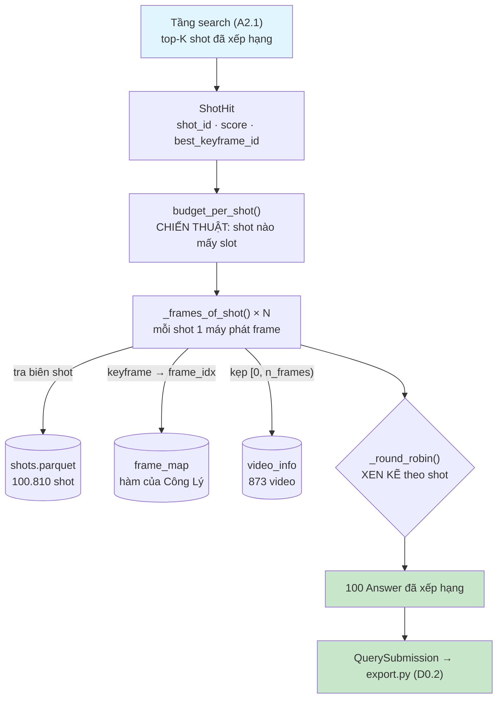

# 📋 Báo Cáo Kỹ Thuật — Task D3.1: Slot Allocator

> **Ngày:** 07/08/2026 · **rà lại 10/08/2026** · **Hạn:** 09/08/2026
>
> **Người thực hiện:** Minh Hoàng
>
> **Phạm vi:** `backend/slot/` + `data/config/slot_budget.py` + `tests/test_allocator.py`
>
> ⚠️ **Đọc mục 10 trước khi tin bất cứ con số nào ở đây.** Task này làm sớm hơn tiến độ
> chung, nên một số đầu vào còn là giả lập và một phụ thuộc đang gãy — mục 10 nói rõ
> chỗ nào.

---

## Mục lục
1. [Vấn đề phải giải](#1-vấn-đề-phải-giải)
2. [Luồng hoạt động](#2-luồng-hoạt-động)
3. [Chia vai: chiến thuật và cơ chế](#3-chia-vai-chiến-thuật-và-cơ-chế)
4. [Máy phát frame — bốn mức ưu tiên](#4-máy-phát-frame--bốn-mức-ưu-tiên)
5. [Vòng tròn xen kẽ](#5-vòng-tròn-xen-kẽ)
6. [Ba dạng bài](#6-ba-dạng-bài)
7. [Chi tiết từng hàm](#7-chi-tiết-từng-hàm)
8. [Kết quả chạy thực tế](#8-kết-quả-chạy-thực-tế)
9. [Đo độ trễ](#9-đo-độ-trễ)
10. [⚠️ Phần TREO và phần có thể LỆCH](#10-️-phần-treo-và-phần-có-thể-lệch) — kèm [**10.1 run_minimal không gọi allocate()**](#101-hợp-đồng-với-tầng-search--khớp-nhưng-chưa-ai-nối-dây) · [10.5 phụ thuộc đã sửa](#105--đã-sửa--backendindexingframe_mappy)
11. [🧪 Code chỉ để thử nghiệm — bỏ khi vào thi](#11--code-chỉ-để-thử-nghiệm--bỏ-khi-vào-thi)
12. [Đối chiếu với yêu cầu](#12-đối-chiếu-với-yêu-cầu)
13. [Kết luận](#13-kết-luận)

---

## 1. Vấn đề phải giải

Tầng search đưa xuống một danh sách shot đã xếp hạng. Nhiệm vụ: biến nó thành **đúng
100 dòng đáp án**, đã xếp hạng, sẵn sàng nộp.

Ba ràng buộc mâu thuẫn nhau, và bảng dưới là chỗ chúng gặp nhau:

**1. Đúng shot chưa chắc đúng đáp án.** BTC chấm `frame_id ∈ [s, e]` — một cửa sổ hẹp
**bên trong** shot, không phải cả shot. Số thật từ `shots.parquet`:

| | frame |
|:---|---:|
| shot ngắn nhất | 12 |
| median | **69** |
| dài nhất | 1795 |

Đặt đúng 1 frame vào một shot 69 frame là tìm ra rồi mà vẫn có thể trượt.

**2. Nhưng chiều sâu thì miễn phí.** `frame_id` chỉ là số nguyên trong `[0, n_frames)`,
không cần ảnh, không cần embedding, không cần được index (`BUILD_TASKS` D3.1). Đào sâu
không tốn GPU, không tốn gì.

**3. Thứ tự nộp quyết định gần một nửa số điểm.** `R@1 + R@5 = 40%` tổng điểm. Dồn 8
slot đầu vào shot hạng 1 mà shot đó sai là mất trắng cả hai.

→ Bài toán: **chia 100 slot cho bao nhiêu shot, mỗi shot mấy slot, và phát ra theo
thứ tự nào.**

---

## 2. Luồng hoạt động



**Đây là nơi cuối cùng còn biết `frame_idx` thật.** Tầng định dạng đã bị tước hết khả
năng tra bảng ở W0.2 — nó chỉ ghi ra con số nhận được. Nghĩa là file này cấp sai frame
thì **không còn chốt chặn nào phía sau**.

---

## 3. Chia vai: chiến thuật và cơ chế

| File                         | Vai                                                     | Nhịp thay đổi                         |
| :-----------------------------| :--------------------------------------------------------| :--------------------------------------|
| `data/config/slot_budget.py` | **CHIẾN THUẬT** — cược bao nhiêu slot vào shot hạng mấy | đổi nhiều lần (D4.1 có hẳn task tune) |
| `backend/slot/allocator.py`  | **CƠ CHẾ** — rút frame, xen kẽ, bảo đảm đủ 100          | viết một lần là xong                  |

Tách ra vì hai thứ này đổi với nhịp khác nhau. Lúc tune chỉ sửa **một dòng số**, không
đụng logic, không sợ làm hỏng phần cấp phát.

### Bảng ngân sách

```python
SLOT_BUDGET = [(3, 8), (7, 5), (10, 3), (11, 1)]   # 24+35+30+11 = 100, phủ 31 shot
```

| Hạng shot | Slot/shot | Ý đồ |
|:---|:---:|:---|
| 1–3 | 8 | tin nhất → đào sâu, gần như chắc trúng cửa sổ |
| 4–10 | 5 | khá tin |
| 11–20 | 3 | phòng hờ |
| 21–31 | 1 | vé số — nhưng ô 51–100 bỏ trống cũng là vứt điểm miễn phí |

`budget_per_shot(n_shots)` trải bảng này ra thành hạn mức từng shot, và nuốt luôn hai ca
lệch để `allocator.py` không phải biết:

- **Ít shot hơn bảng** (search chỉ ra 3 shot) → thiếu 76 slot, rải **vòng tròn** cho đủ
  100 → `[34, 33, 33]`. Rải vòng tròn chứ không dồn hết vào shot 1: dồn hết là quay lại
  đúng cái sai mà luật xen kẽ đang tránh.
- **Nhiều shot hơn bảng** → shot thứ 32 trở đi nhận 0.

> [!NOTE]
> Bất biến: `sum(budget_per_shot(n)) == 100` với **mọi** n. Đã quét n = 1…499.

---

## 4. Máy phát frame — bốn mức ưu tiên

Trái tim của file. Mỗi shot có một **generator**, xả frame theo độ tin cậy giảm dần:

| Mức | Nguồn | Vì sao đứng ở vị trí đó |
|:---:|:---|:---|
| ① | `frame_map[best_keyframe_id]` | Frame mình **thực sự có bằng chứng**, không phải điểm giữa tính ra |
| ② | rải đều trong vùng đã **thụt 10%** hai đầu | Frame sát biên shot hay dính chuyển cảnh — mờ, hoặc lẫn hai cảnh |
| ③ | mọi frame còn lại trong shot | Khi ② hết vì shot được cấp nhiều slot |
| ④ | nới dần ra ngoài biên shot, kẹp `[0, n_frames)` | **Chốt chặn cuối** |

Hai chi tiết quyết định tính đúng:

**a) Mức ④ là thứ làm bất biến "luôn đủ 100 dòng" thành đúng.** Shot 12 frame vẫn đẻ
được 100 frame khác nhau vì nó nới ra ngoài. Không cần viết nhánh `if` riêng cho ca
biên — độ sâu tự lo.

**b) Máy phát TỰ khử trùng.** Bốn mức chồng lấn nhau (mức ③ quét cả vùng mức ② đã phát).
Khử trùng đặt ngay trong generator, không đẩy cho chỗ gọi.

> [!WARNING]
> Đây là **bug thật gặp lúc code**. Ban đầu generator lặp lại chính nó. KIS không lộ vì
> `_round_robin` có khử trùng riêng, còn TRAKE rút thẳng nên đẻ ra dòng trùng và chết ở
> dòng 80/100. Sửa bằng cách đưa khử trùng **vào hợp đồng của generator**, không vá chỗ
> gọi — chỗ gọi thứ ba sẽ lại quên.

**c) Mức ① không bị kẹp về biên shot.** Nếu `frame_map` và `shots.parquet` lệch nhau thì
tin `frame_map` — đó mới là con số BTC chấm.

---

## 5. Vòng tròn xen kẽ

```python
while len(ket_qua) < can:
    for i, (video_id, gen) in enumerate(nguon):
        if quotas[i] <= vong:      # shot này hết hạn mức ở vòng này
            continue
        for f in gen:              # rút tới khi được frame CHƯA dùng
            if (video_id, f) not in da_dung:
                ket_qua.append((video_id, f)); break
    vong += 1
```

Vòng `r` phát frame thứ `r` của **mọi** shot còn hạn mức:

| Vòng | Shot tham gia | Cộng dồn |
|:---:|:---|---:|
| 0 | cả 31 | 31 |
| 1–2 | 20 shot đầu | 71 |
| 3–4 | 10 shot đầu | 91 |
| 5–7 | 3 shot đầu | **100** |

Kết quả thật (31 shot ứng viên):

```
hạng 1: L21_V001, 34     ← shot 1
hạng 2: L21_V001, 350    ← shot 2
hạng 3: L21_V001, 388    ← shot 3
hạng 4: L21_V001, 415    ← shot 4
hạng 5: L21_V001, 463    ← shot 5
```

Năm slot đầu là **năm shot khác nhau** → shot hạng 1 sai vẫn còn nguyên cửa R@5.

Hai chi tiết:
- **Khử trùng theo cặp `(video_id, frame)`**, không phải theo `frame`. Frame 500 của hai
  video khác nhau là hai câu trả lời khác nhau.
- Vòng `for f in gen` bên trong: frame trùng **không tốn slot**, chỉ đẩy generator đi
  tiếp. Đó là lý do luôn ra đúng 100 chứ không phải "khoảng 100".

---

## 6. Ba dạng bài

| Dạng | Cách làm |
|:---|:---|
| **KIS** | như trên, 1 frame mỗi dòng |
| **Q&A** | y hệt KIS, đóng `answer_text` do module Q&A cấp vào cả 100 dòng. Thiếu `answer_text` → **raise**, tầng slot không bịa câu trả lời |
| **TRAKE** | xếp hạng theo **VIDEO**, không theo shot |

### Vì sao TRAKE xếp theo video

Tài liệu BTC, dạng bài TRAKE: **sai video = 0 tuyệt đối**; đúng video thì được điểm **từng phần**
theo tỉ lệ khoảnh khắc khớp (3/4 → 0.75). Nên 100 dòng đầu phải phủ **nhiều video**,
không phải nhiều phương án của cùng một video.

Mỗi video có N máy phát, một cho mỗi khoảnh khắc, lấy từ N shot điểm cao nhất của nó.
Dòng thứ j = frame thứ j của từng máy, sắp tăng dần. Video ít shot hơn N → dùng lại
shot tốt nhất, khoảnh khắc lấy sâu hơn.

Sau khi sắp vẫn có thể hai khoảnh khắc trùng frame → đẩy lên 1 đơn vị. Thà lệch 1 frame
còn hơn nộp dòng bị validator loại vì không tăng dần ngặt.

---

## 7. Chi tiết từng hàm

### 7.1. `data/config/slot_budget.py`

| Tên | Mô tả |
|:---|:---|
| `SLOT_BUDGET` | Bảng cược. `TODO: BTC` — phụ thuộc độ rộng cửa sổ `[s,e]` |
| `ANSWERS_PER_QUERY` | 100 — **nhập từ `submit_format.py`**, không khai báo lại. Luật BTC thì chỉ được có một nơi giữ |
| `SHOT_EDGE_INSET` | 0.10 — thụt mỗi đầu shot, tránh frame chuyển cảnh |
| `TRAKE_DEFAULT_N` | 4. `TODO: BTC` — chưa rõ đề có công bố N không |
| `budget_per_shot()` | Trải bảng → hạn mức từng shot. Tổng **luôn** = 100 |

### 7.2. `backend/slot/allocator.py`

| Tên | Mô tả |
|:---|:---|
| `ShotHit` | Đầu vào: `shot_id` · `score` · `best_keyframe_id`. `score` chỉ để **xếp hạng**, không so ngưỡng — cosine CLIP thực tế quanh 0.2–0.3 (CLAUDE.md bất biến 6) |
| `_shots()` | `shot_id → (video_id, start, end)`. `@lru_cache` → đọc đĩa 1 lần cho cả tiến trình |
| `_frame_of_keyframe()` | Gọi `load_frame_map()` **của Công Lý**, không tự đọc parquet. Trả `None` khi không có — mất mức ① của một shot không đáng làm hỏng cả bài nộp |
| `_spread_evenly()` | m điểm rải đều trên `[a, b]`, gồm cả hai đầu |
| `_frames_of_shot()` | **Máy phát frame** — bốn mức ở mục 4. Tự khử trùng |
| `_round_robin()` | **Xen kẽ** — mục 5 |
| `allocate()` | API công khai. Kiểm đầu vào → sắp theo `score` → cấp hạn mức → quay vòng → bọc `Answer` |
| `_bounds_of()` · `_video_of()` · `_gen_of()` | Ba hàm tra cứu nhỏ, dùng chung cache của `_shots()` |
| `_allocate_trake()` · `_trake_row()` | Nhánh TRAKE — mục 6 |
| `main()` | 🧪 CLI demo — xem mục 11 |

Trả về thẳng `list[Answer]` (class của `submit_format.py`) → cắm vào `QuerySubmission`
là nộp được, không cần tầng dịch ở giữa.

### 7.3. Bốn chốt chặn ở cửa vào `allocate()`

Cả bốn đều **raise**, không cái nào âm thầm sửa dữ liệu hộ. Lý do chung: file này là nơi
cuối cùng còn biết `frame_idx` thật, nên mọi thứ nó nuốt trôi sẽ không còn ai bắt được.

| Đầu vào sai | Phản ứng | Nếu KHÔNG chặn thì sao |
|:---|:---|:---|
| `hits` rỗng | `ValueError` | không có gì để cấp phát |
| `total < 1` | `ValueError` | trả `[]` lặng lẽ → **bài nộp TRẮNG**. Một biến chưa gán ở tầng trên là đủ |
| `n_trake < 2` | `ValueError` | allocator đẻ ra dòng mà chính validator D0.2 từ chối (`frame_count`) |
| `score` là `NaN` | `ValueError`, in kèm shot nào | `sorted()` cho thứ tự **tuỳ ý** → thứ hạng shot ngẫu nhiên, mà vẫn đủ 100 dòng và validator vẫn xanh |

Ba cái sau đều là **lỗi im lặng**: chương trình chạy xong, file sinh ra, không ai biết
gì. Riêng NaN là rủi ro có thật từ khi A2.2 dùng RRF — `1/(K + rank)` sinh NaN nếu
`rank` hỏng.

> [!NOTE]
> `n = TRAKE_DEFAULT_N if n_trake is None else n_trake` — cố ý **không** dùng `or`.
> `n_trake=0` là số 0 falsy, `or` sẽ âm thầm thay bằng 4 thay vì báo lỗi. Đúng kiểu
> thay số lặng lẽ mà W0.2 cấm. Có test riêng cho ca `n=0`.
>
> Ngược lại, `score` âm hoặc bằng 0 là **hợp lệ** và không bị chặn — chỉ NaN mới phá
> được phép sắp xếp. Có test đối chứng cho điều này.

---

## 8. Kết quả chạy thực tế

### 8.1. Bộ test

```
106 test · 103 xanh — 3 đỏ do lỗi import NGOÀI (mục 10.5). **13/08: đã vá, 192/192 xanh**
  tests/test_validator.py : 34 test   (D0.2)
  tests/test_export.py    : 32 test   (D0.2)
  tests/test_allocator.py : 40 test   (D3.1, 6 test canh bốn chốt chặn ở mục 7.3)
```

**Không mock.** Shot lấy từ `shots.parquet`, keyframe từ `frame_map.parquet`, độ dài
video từ `video_info.parquet` — đều là dữ liệu Data Factory đã giao.

| Nhóm test | Kiểm gì |
|:---|:---|
| Bất biến 1 — đủ 100 | 1/2/3/7/31/60 shot · **shot ngắn nhất dataset (12 frame)** vẫn ra 100 frame khác nhau |
| Bất biến 2 — xen kẽ | 5 slot đầu = 5 shot khác nhau · slot 1 là shot điểm cao nhất (test cố tình đảo thứ tự truyền vào) |
| Bất biến 3 — frame thật | frame ∈ `[0, n_frames)` · frame đầu mỗi shot = đúng `frame_map[best_keyframe_id]` · không frame nào rơi vào 10% mép |
| Ba dạng bài | KIS 1 frame · Q&A **từ chối khi thiếu answer** · TRAKE N=3/4/5 tăng dần ngặt · TRAKE 5 dòng đầu = 5 video |
| Bốn chốt chặn (mục 7.3) | `hits` rỗng · `total=0/-5` · `n_trake=0/1` · `score=NaN` — đều raise; kèm ca đối chứng `score` âm/bằng 0 vẫn chạy |
| Chốt cuối | output cắm thẳng vào `validate_submission()` của D0.2 → phải rỗng |

### 8.2. Kiểm chứng bằng cách phá code

| Phá gì | Kết quả |
|:---|:---|
| Gom theo shot thay vì xen kẽ | **20 test đỏ** |
| Bỏ mức ① (không dùng keyframe thật) | 2 đỏ |
| Bỏ mức ④ (không nới ra ngoài shot) | 2 đỏ |
| Bỏ thụt biên 10% | 1 đỏ |
| Bỏ bù slot khi ít shot hơn bảng | 2 đỏ |
| Phục hồi | **103 xanh** (3 đỏ là lỗi ngoài, mục 10.5) |

### 8.3. Quét ngẫu nhiên 120 kịch bản

Ngoài test cố định, đã chạy 40 lần bốc ngẫu nhiên × 3 dạng bài:
- số shot ứng viên: 1 … 55
- số video: 1 … 12
- TRAKE N: 2 … 6

Kết quả: **120/120 ra đúng 100 dòng và validator im lặng.**

### 8.4. Ca biên xấu nhất

```
1 shot, 12 frame — shot NGẮN NHẤT toàn bộ dataset [10008, 10019]
→ 100 dòng, 100 frame KHÁC NHAU, trải 9964 … 10063
→ validator: HỢP LỆ
```

Đây là lúc mức ④ làm việc: 12 frame không đủ, generator nới ra ngoài biên shot.

---

## 9. Đo độ trễ

CLAUDE.md v3 mục *Coding convention*: mỗi tối ưu phải kiểm chứng/đo được.

| Thao tác | Thời gian |
|:---|---:|
| Nạp `shots.parquet` (100.810 shot) — **1 lần/tiến trình** | 1042 ms |
| Nạp `frame_map` của Công Lý — **1 lần/tiến trình** | 1105 ms |
| Nạp `video_info` — **1 lần/tiến trình** | 12 ms |
| **Cấp phát 100 slot — KIS** | **1.31 ms** |
| Cấp phát 100 slot — Q&A | 1.48 ms |
| Cấp phát 100 slot — TRAKE | 2.34 ms |

~2.2 s là chi phí **một lần lúc khởi động**, không phải lúc bấm nộp. Việc chạy mỗi query
là **1–2 ms**. Ngân sách 30s: tầng này chiếm 0.007%.

```
cache _shots: misses=1, hits=39.999 · cùng một object trong RAM
```

> [!NOTE]
> 2.2 s đó phải trả lúc **khởi động server**, không phải lúc người vận hành bấm nút.
> `run_minimal.py` (A6.2-early của Thạch) nên gọi warm sẵn `_shots()` và `n_frames_of()`
> lúc boot.

---

## 10. ⚠️ Phần TREO và phần có thể LỆCH

> Task này làm **trước** tiến độ chung. Bảng dưới là những chỗ đang chạy trên giả định,
> sẽ phải sửa khi người khác giao hàng. **Đọc kỹ trước khi tin kết quả.**

### 10.1. Hợp đồng với tầng search — khớp, nhưng chưa ai nối dây

`search()` (A2.1+A2.2) trả mỗi kết quả gồm:

```python
{keyframe_id, video_id, frame_idx, timestamp_ms, shot_id, score, ranks, contrib}
```

Nó **gom về shot bằng cách giữ keyframe điểm cao nhất mỗi shot**, nên ba thứ allocator
cần đều có sẵn. Đã kiểm trên dữ liệu thật:

| Điều kiện | Kết quả |
|:---|:---|
| `shot_id` của search phải có trong `shots.parquet` | **94.386/94.386 khớp, 0 lệch** |
| `keyframe_id` của Milvus phải tra được `frame_map` | **khớp** — cùng dạng `L21_V001#k0001` |
| Mỗi shot phải có keyframe điểm cao nhất → mức ① | **có** — chính là `keyframe_id` trả về |

Mẩu keo dán cần viết chỉ có một dòng:

```python
hits = [ShotHit(r["shot_id"], r["score"], r["keyframe_id"]) for r in search(...)]
```

Nó thuộc `run_minimal.py` (A6.2-early của Thạch). Không viết vào allocator vì đó là việc
của tầng điều phối, không phải của tầng cấp phát.

> [!CAUTION]
> **Rà soát 13/08 — vấn đề nặng hơn "chưa ai nối dây".** `run_minimal.py` đã tồn tại và
> đã chạy được đầu-cuối, nhưng nó **không gọi `allocate()`**. Nó tự chia slot bằng
> `_chia_slot()` + `_don_cho_du()` của riêng nó.
>
> Kiểm chứng: `grep -rn "backend.slot" --include=*.py .` chỉ ra hai chỗ — hàm demo của
> `exporter.py` và CLI `python -m backend.slot`. **Không có chỗ nào trên đường nộp bài.**
>
> Hai cách chia slot khác nhau về bản chất:
>
> | | `allocate()` (D3.1) | `_chia_slot()` (`run_minimal.py`) |
> |:---|:---|:---|
> | Một slot là | frame bất kỳ trong shot | **đúng một keyframe** đã index |
> | Đào sâu trong shot | có — mức ②③④ | **không** |
> | Xen kẽ theo shot | có, theo bảng ngân sách | không, theo thứ hạng search |
> | Khi thiếu slot | nới ra ngoài biên shot | độn `frame 0` của video chưa dùng |
>
> Hệ quả:
> 1. **Toàn bộ phần đào sâu theo shot đang không chạy.** Đặc tả D3.1 ghi *"`frame_idx`
>    không cần là keyframe đã index — độ sâu là miễn phí"*. Đường nộp thật đang bỏ
>    đúng thứ đó.
> 2. **D4.1 (17/08 — tune bảng ngân sách) sẽ vô nghĩa** nếu nối dây không xong trước.
>    Tune một bảng mà đường nộp không đọc tới.
> 3. Phần độn: `allocate()` độn bằng frame sâu trong shot ứng viên (còn cơ hội đúng),
>    `_don_cho_du()` độn bằng `frame 0` của video chưa dùng (*"gần như chắc sai"* —
>    lời chú thích trong chính file đó).
>
> Đây **không phải lỗi của ai**: `run_minimal.py` là A6.2-**early**, viết ra để ghép ống
> cho pipeline chạy hết đường trước khi D3.1 xong. Nhưng giờ D3.1 xong rồi mà chưa ai
> đổi. Việc cần làm thuộc Thạch (chủ `run_minimal.py`), **không tự sửa được từ D3.1**.

### 10.2. 🟡 CHẠY ĐƯỢC nhưng đang giả định — sẽ phải sửa

| # | Chỗ | Đang giả định gì | Chờ ai | Nếu sai thì sao |
|:---:|:---|:---|:---|:---|
| 1 | `SLOT_BUDGET = [(3,8),(7,5),(10,3),(11,1)]` | Cửa sổ `[s,e]` của BTC vừa phải | **Linh → BTC** | CLAUDE.md mục *Điều CHƯA chốt* liệt đây là thứ BTC phải trả lời. Cửa sổ rộng → nên rải rộng; hẹp → nên đào sâu. **D4.1 (17/08) là task tune bảng này** |
| 2 | `TRAKE_DEFAULT_N = 4` | Đề TRAKE không công bố N | **Linh → BTC** | Sai N → validator bắt được (`trake_n_mismatch`), không phải lỗi im lặng |
| 3 | `SHOT_EDGE_INSET = 0.10` | 10% mỗi đầu là đủ tránh frame chuyển cảnh | tôi | Con số cảm tính, chưa đo. D4.1 tune cùng bảng ngân sách |

Cả ba đều nằm trong `data/config/slot_budget.py` — chốt lại là **sửa một dòng số**, không
đụng tới cơ chế cấp phát.

### 10.3. 🟠 RỦI RO DỮ LIỆU — đã đo, biên độ nhỏ

| # | Vấn đề | Số thật | Chờ ai | Đánh giá |
|:---:|:---|:---|:---|:---|
| 4 | **Không còn cách nào biết frame nào đã kiểm chứng.** Bản `frame_map` 07/08 **xoá** hai cột `offset_verified` và `frame_idx_status` | `frame_map` từ 14 cột còn 6 | **Công Lý** | Giá trị `frame_idx` vẫn là bản đã bù offset (kiểm: 19.380/177.321 dòng bằng `floor(pts×fps)+1`, nhiều hơn bản cũ 81 dòng → Lý sửa thêm chứ không bớt). Mất **hồ sơ**, không mất **dữ liệu**. Nhưng sau đợt thi, soi một câu trượt sẽ không trả lời được "số này đã so pixel hay đang giả định" |
| 5 | `path` trong `video_info` chết **873/873** | trỏ `data/raw/videos/...` không tồn tại | **Công Lý** | Không ảnh hưởng allocator (không đọc video). Nhưng `scripts/verify_frame_map.py` sẽ gãy |

### 10.4. 🔵 CHỦ Ý ĐỂ SAU

| # | Việc | Khi nào |
|:---:|:---|:---|
| 6 | **TRAKE mới là v1** — xếp hạng theo video + N shot cao điểm nhất. Chưa có DP theo trình tự thời gian (khoảnh khắc 1 phải trước khoảnh khắc 2 về mặt *ngữ nghĩa*, không chỉ về số frame) | CLAUDE.md xếp "TRAKE DP" vào danh sách cắt, có đường quay lại **sau đợt 1** |

---

### 10.5. ✅ Phụ thuộc `backend/indexing/frame_map.py` — đã thông

Allocator tra `keyframe_id → frame_idx` qua `load_frame_map()` của Công Lý, **không tự
đọc parquet**: bảng đó có bù offset, tự đọc lại là mở đường cho hai nguồn sự thật. Cái
giá của lựa chọn đó là mức ① phụ thuộc hoàn toàn vào module ấy.

Module từng gãy (thiếu `preprocessing.common.frame_map` sau một lần revert), Công Lý đã
vá 13/08. Hiện `import` sạch, toàn bộ test xanh.

> [!IMPORTANT]
> Bài học giữ lại, không phải sự cố: **`python -m backend.slot --demo` KHÔNG chạm hàm
> đó** vì demo không truyền `keyframe_id`. Lúc module gãy, demo vẫn in ra 100 dòng và
> báo "HỢP LỆ", chỉ đường chạy thật mới nổ. Demo xanh không chứng minh được gì về
> đường có `best_keyframe_id` — đừng dùng nó làm phép kiểm cuối trước khi nộp.

### 10.6. 🔵 `CLAUDE.md` mô tả ngược thiết kế hiện tại

```
| Format submit | data/config/submit_format.py | frame_id = hậu tố keyframe_id |
```

Đúng cái W0.2 đã xoá khỏi code. Ai đọc `CLAUDE.md` lần đầu sẽ hiểu ngược hoàn toàn:
tầng format **không** suy `frame_id` từ `keyframe_id`, và sẽ không bao giờ suy nữa.

## 11. 🧪 Code chỉ để thử nghiệm — bỏ khi vào thi

> Những thứ dưới đây **không thuộc đường chạy lúc thi**. Liệt kê ra để sau này không ai
> tưởng nhầm là code sản xuất.

| # | Chỗ | Là gì | Xử lý |
|:---:|:---|:---|:---|
| 1 | `allocator.main()` + `backend/slot/__main__.py` | CLI `--demo`: dựng `ShotHit` **giả lập** từ `shots.parquet` (bốc 3 shot mỗi video) rồi cấp phát | **Giữ tới G2**, tiện xem tận mắt 100 dòng mà không cần Milvus/ES. Sau đó xoá hoặc để nguyên — nó không nằm trong đường chạy |
| 2 | `allocator.py` tham số `--shots` | Số shot ứng viên giả lập | Chỉ có ở CLI demo |
| 3 | `exporter._demo_subs()` + `--demo` | Sinh bài nộp giả từ video thật (D0.2) | Như trên |
| 4 | `write_submissions(..., validate=False)` | Đường thoát để ghi dữ liệu hỏng ra soi | ⚠️ **TUYỆT ĐỐI không dùng ngày nộp.** Mặc định là `True`; nếu ai đó đặt `False` thì bài nộp sai vẫn ra file trông hợp lệ |
| 5 | `csv_header_v0` · `json_v0` | Hai trong ba format là **phỏng đoán dự phòng** | BTC chốt format → **xoá hai cái không dùng**, giữ đúng một. Để lại ba cái là để lại ba cách nộp sai |
| 6 | `SUBMIT_FORMAT = "csv_v0"` | Đang chọn đại một trong ba | Sửa đúng dòng này khi BTC trả lời |
| 7 | `allocate(total=...)` | Tham số cho phép khác 100 | Chỉ dùng để test. Lúc thi **luôn 100** (`BUILD_TASKS` D3.1). Từ 09/08 `total < 1` bị raise |
| 8 | `allocate(table=...)` | Cho truyền bảng ngân sách khác | Dùng ở D4.1 để tune. Lúc thi để mặc định |
| 9 | `tests/conftest.py`: `hits_of()`, `build_sub()`, `shots_of()` | Dựng dữ liệu test | Nằm trong `tests/`, không bao giờ chạy lúc thi |

**Điểm 4 và 5 là hai chỗ dễ gây tai nạn nhất** — cả hai đều tạo ra file nộp *trông* hợp
lệ mà sai.

---

## 12. Đối chiếu với yêu cầu

### 12.1. `BUILD_TASKS.md` — D3.1

| Yêu cầu | |
|:---|:---:|
| `backend/slot/allocator.py`, nhận top-K shot + `query_type`, trả đúng 100 dòng | ✅ |
| Bảng khởi điểm `3×8 + 7×5 + 10×3 + 11×1 = 100`, **để trong config** | ✅ |
| ⚠️ XEN KẼ theo shot, KHÔNG gom | ✅ 5 slot đầu = 5 shot |
| `frame_idx` không cần là keyframe đã index | ✅ mức ②③④ phát frame bất kỳ |
| Frame ĐẦU TIÊN mỗi shot = keyframe điểm cao nhất | ✅ mức ①, có test |
| Frame tiếp theo rải đều, **thụt 10% mỗi đầu**, ép `int`, khử trùng | ✅ |
| Slot allocator chịu trách nhiệm cấp `frame_idx` THẬT | ✅ qua `load_frame_map()` của Công Lý |
| ⚠️ **KHÔNG BAO GIỜ trả < 100 dòng**, kể cả khi chỉ có 3 shot | ✅ mức ④; test tới ca 1 shot × 12 frame |
| Unit test cả ba dạng bài, gồm ca biên | ✅ 40 test |

### 12.2. `CLAUDE.md`

| Yêu cầu | |
|:---|:---:|
| `BUILD_TASKS` D3.1 — luôn nộp đủ 100 slot | ✅ |
| Mục 6 quy tắc 3 — thứ tự XEN KẼ theo shot | ✅ |
| Mục 7 — `frame_id` không cần là keyframe đã index | ✅ |
| Bất biến 6 — **không đặt ngưỡng điểm cứng** | ✅ `score` chỉ dùng để sắp xếp, không so với ngưỡng nào |
| *Coding convention* — mỗi tối ưu phải đo được | ✅ mục 9 |
| Không hardcode ngưỡng / đường dẫn, đọc từ config | ✅ `slot_budget.py` |
| Assert lúc nạp `.parquet` | ✅ `_read_columns()` — thiếu cột thì báo tên cột và ai phải giao |

### 12.3. Chỗ lệch so với chữ trong tài liệu

| Chỗ | Lý do |
|:---|:---|
| `ShotHit` chỉ có `shot_id` + `score` + `best_keyframe_id`, **không có `start_frame`/`end_frame`** | Biên shot tra thẳng từ `shots.parquet`. Bắt tầng search truyền xuống là tạo nguồn sự thật thứ hai |
| Không dùng `rep_kf_id` của `shots.parquet` | Spec ghi frame đầu mỗi shot là keyframe **điểm cao nhất từ search** — thứ đó phụ thuộc query, còn `rep_kf_id` chọn tĩnh nên không thay thế được. Search đã cấp `best_keyframe_id` thật (mục 10.1), thêm một đường thứ hai để lấy cùng con số chỉ tạo **hai nguồn sự thật**: lúc chúng lệch nhau sẽ không ai biết mức ① đang lấy frame từ đâu |

---

## 13. Kết luận

| Hạng mục | Trạng thái |
|:---|:---|
| Luôn đủ 100 dòng, mọi ca biên | ✅ tới ca 1 shot × 12 frame |
| Xen kẽ theo shot | ✅ 5 slot đầu = 5 shot, phá code thì 20 test đỏ |
| `frame_idx` thật qua `frame_map` của Công Lý | ✅ không tự đọc parquet, một nguồn sự thật |
| Ba dạng bài | ✅ KIS + Q&A đầy đủ · TRAKE v1 |
| Chiến thuật tách khỏi cơ chế | ✅ tune = sửa một dòng số |
| Nối vào validator D0.2 | ✅ output nộp được ngay |
| Độ trễ | ✅ 1–2 ms mỗi query |
| **Hợp đồng với search thật** | ✅ **Khớp 10/08** — A2.1+A2.2 trả `shot_id` + `score` + `keyframe_id` tốt nhất mỗi shot; `shot_id` khớp `shots.parquet` 94.386/94.386 |
| Keo dán `search() → ShotHit` | 🔴 **`run_minimal.py` tự chia slot, KHÔNG gọi `allocate()`** — mục 10.1 |
| Chốt an toàn khi Data Factory đổi schema | ✅ `_read_columns()` + 2 test (thêm 07/08) |
| Bốn chốt chặn ở cửa vào `allocate()` | ✅ 6 test — mục 7.3 |
| `backend/indexing/frame_map.py` chạy được | ✅ Công Lý đã vá 13/08 — mục 10.5 |

### Danh sách file được tạo / sửa

| File | Vai trò | Dòng |
|:---|:---|---:|
| `backend/slot/allocator.py` | Cơ chế cấp phát — tạo mới | 422 |
| `backend/slot/__init__.py` | Re-export `allocate`, `ShotHit` | 7 |
| `backend/slot/__main__.py` | `python -m backend.slot --demo` | 5 |
| `data/config/slot_budget.py` | Chiến thuật — tạo mới | 78 |
| `tests/test_allocator.py` | 40 test trên shot thật | 320 |
| `tests/conftest.py` | Thêm `_shots_df()`, `shots_of()`, `hits_of()` | 178 |

**Dọn kèm:** `backend/export.py` → package `backend/export/`
(`__init__.py` + `__main__.py` + `exporter.py`), theo đúng kiểu `backend/llm/` của Thạch.
Đường import `backend.export` **không đổi** nên không file nào phải sửa theo.

### Cách chạy / kiểm

```powershell
python -m pytest -q      # 13/08: 192 passed, 0 failed (mục 10.5 đã vá)
python -m backend.slot --demo --task KIS
python -m backend.slot --demo --task TRAKE
python -m backend.export --demo              # D0.2 — chạy allocator thật rồi ghi file nộp
```

### Task tiếp theo

**D4.1 — Chỉnh slot theo dữ liệu** (17→19/08): chạy dev set, thử vài bảng `SLOT_BUDGET`,
ghi vào `reports/slot_tuning.md`. `BUILD_TASKS` gọi đây là *"điểm miễn phí, không cần
model mạnh hơn"*.

Trước đó cần hai thứ, đều không nằm trong file này: **vá `frame_map.py`** (mục 10.5) và
**mẩu keo dán `search() → ShotHit`** (mục 10.1). Có đủ hai thứ đó thì ống thông từ query
tới file nộp.
